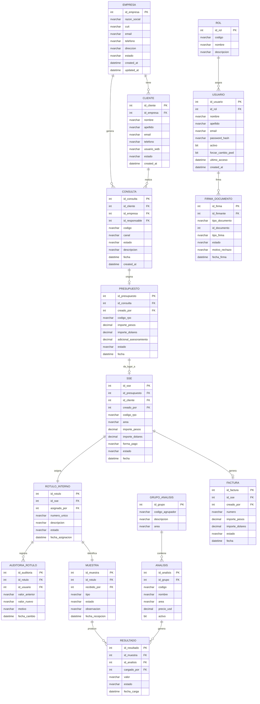
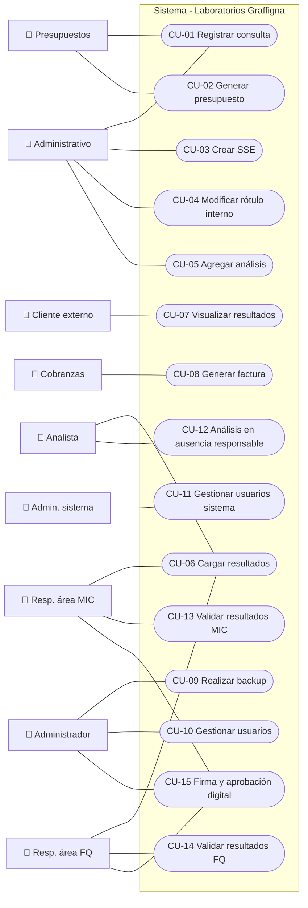
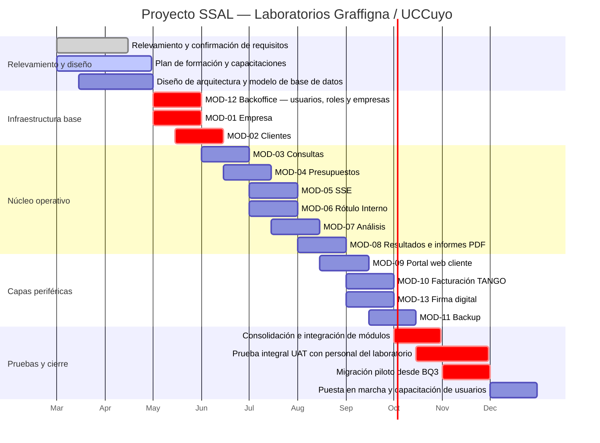

# Laboratorios Graffigna — UCCuyo

## Sistema de Seguimiento de Análisis de Laboratorio (SSAL)

### Documento de Requisitos Funcionales

| Campo               | Detalle                                            |
| ------------------- | -------------------------------------------------- |
| Versión             | 2.5 — Documento consolidado                        |
| Fecha               | 20 de Abril 2026                                   |
| Elaborado por       | Equipo de desarrollo — Área de Sistemas UCCuyo     |
| Revisado por        | Microb. Marta Gaido (PO) — Ing. Fabián Lucena (PM) |
| Estado              | Borrador — Para revisión y aprobación del cliente  |
| Repositorio         | github.com/uccuyo/sal                              |
| Sistema reemplazado | BQ3 — Sistema de gestión anterior del laboratorio  |

---

## Índice

1. [Introducción](#1-introduccion)
2. [Bitácora de relevamiento](#2-bitacora-de-relevamiento)
3. [Descripción del sistema actual](#3-descripcion-del-sistema-actual)
4. [Problemas y hallazgos detectados](#4-problemas-y-hallazgos)
5. [Requisitos funcionales](#5-requisitos-funcionales)
6. [Glosario](#6-glosario)
7. [Descripción de roles](#7-descripcion-de-roles)
8. [Casos de uso](#8-casos-de-uso)
9. [Diagrama BPMN del proceso principal](#9-diagrama-bpmn)
10. [Diagrama de entidades](#10-diagrama-de-entidades)
11. [Diagrama de casos de uso](#11-diagrama-de-casos-de-uso)
12. [Módulos del sistema](#12-modulos-del-sistema)
13. [Capa de backoffice](#13-capa-de-backoffice)
14. [Planificación y cronograma](#14-planificacion-y-cronograma)
15. [Control de cambios](#15-control-de-cambios)

---

## 1. Introducción

### 1.1 Propósito del documento

El presente documento formaliza los requisitos funcionales del Sistema de Seguimiento de Análisis de Laboratorio (SSAL), destinado a reemplazar el sistema BQ3 actualmente en uso en el Laboratorio de Control de Calidad Dr. Alberto Graffigna, dependiente de la Universidad Católica de Cuyo (UCCuyo).

El documento consolida toda la información relevada durante las visitas realizadas al laboratorio entre el 9 y el 25 de marzo de 2026, e incorpora las decisiones técnicas y funcionales tomadas durante el análisis y diseño. Tiene carácter de acuerdo base entre el equipo de desarrollo y el laboratorio, y debe ser revisado y aprobado por el Product Owner antes del inicio del desarrollo.

Cualquier modificación posterior deberá registrarse en la sección [16. Control de cambios](#16-control-de-cambios).

### 1.2 Alcance del sistema

El sistema SSAL cubrirá los siguientes procesos:

- Gestión de empresas y clientes del laboratorio.
- Recepción y seguimiento de consultas y pedidos.
- Confección, envío y registro de presupuestos.
- Registro de la Solicitud de Muestreo (RPG 06-18 / EPG 06) como etapa previa al ingreso de la muestra.
- Registro de la Solicitud de Servicio Estándar (SSE) y asignación del Número de Rótulo Interno.
- Carga y gestión de análisis de muestras.
- Carga de resultados y generación de informes PDF.
- Firma digital de documentos con flujo de doble validación.
- Visualización de resultados por parte del cliente externo vía portal web.
- Facturación e integración con el sistema TANGO.
- Resguardo de la base de datos mediante backup programado.
- Gestión de usuarios, roles y accesos (backoffice).

**Fuera de alcance:**

- Gestión integral de inventario del laboratorio.
- Integración con sistemas académicos institucionales de la UCCuyo.
- Módulos de Inteligencia Artificial (previstos para una fase posterior).

### 1.3 Equipo del proyecto

| Rol                      | Persona                 | Responsabilidades                                                               |
| ------------------------ | ----------------------- | ------------------------------------------------------------------------------- |
| CTO                      | Lic. Cristian Fernández | Supervisión tecnológica y estratégica del proyecto.                             |
| Project Manager (PM)     | Ing. Fabián Lucena      | Planificación, seguimiento, gestión de riesgos y comunicación con stakeholders. |
| Product Owner (PO)       | Microb. Marta Gaido     | Definición y priorización del backlog. Validación funcional del sistema.        |
| Coordinador académico    | A designar              | Articulación con la Tecnicatura en Desarrollo de Software.                      |
| Desarrolladores (x2)     | A contratar             | Desarrollo full-stack durante 10 meses. React + .NET C# + SQL Server.           |
| Pasantes (x4)            | Alumnos Tecnicatura     | 100 horas cada uno en distintas etapas del proyecto.                            |
| Personal técnico UCCuyo  | Área de Sistemas        | Acompañamiento técnico, infraestructura y despliegue.                           |
| Personal del laboratorio | Equipo Graffigna        | Validación funcional, pruebas y aceptación del sistema.                         |

### 1.4 Metodología de relevamiento

El relevamiento se llevó a cabo mediante visitas presenciales al sector administrativo y técnico del laboratorio durante los días 9, 10, 11, 16, 18 y 25 de marzo de 2026. En cada sesión se realizaron observación directa, entrevistas con el personal, registro fotográfico de las interfaces del sistema BQ3 y documentación de hallazgos y sugerencias.

---

## 2. Bitácora de relevamiento

Esta sección registra cronológicamente cada sesión de relevamiento realizada en el laboratorio. Constituye la fuente primaria de la que se derivan los requisitos funcionales del sistema.

---

### 2.1 Día 1 — 9 de marzo de 2026

| Campo    | Detalle                                                                                     |
| -------- | ------------------------------------------------------------------------------------------- |
| Fecha    | 9 de marzo de 2026                                                                          |
| Objetivo | Coordinar horarios, presentar el proyecto e iniciar el relevamiento del workflow operativo. |

**Observaciones:**

- Los primeros pasos del workflow operativo no se encuentran incluidos en BQ3. La recepción de consultas y la gestión inicial del cliente se realizan completamente fuera del sistema.
- Se detectó desorden en la recepción de propuestas de clientes vía mail: todas las consultas convergen en un único correo compartido.

**Hallazgos:**

- El flujo de trabajo no tiene un punto de entrada digital unificado. BQ3 se usa recién a partir del registro de la muestra, dejando sin registro formal la etapa de consulta y presupuesto.
- El personal muestra alto interés y predisposición para colaborar con el proyecto.
- Se propone actualización del hardware del área administrativa como mejora complementaria.

**Próximos pasos:** Profundizar el relevamiento del workflow completo y recopilar información de cada etapa del proceso.

---

### 2.2 Día 2 — 10 de marzo de 2026

| Campo    | Detalle                                                                    |
| -------- | -------------------------------------------------------------------------- |
| Fecha    | 10 de marzo de 2026                                                        |
| Objetivo | Relevar el workflow completo desde el inicio hasta la entrega del informe. |

**Workflow relevado:**

1. El workflow comienza con el contacto del cliente vía WhatsApp o mail. La información se almacena en una planilla Excel llamada **Sistema de Gestión RPO 01-12**.
2. El personal responde las consultas vía mail adjuntando PDFs: presupuesto, procedimientos, disposiciones, certificaciones ISO 9001 y certificaciones habilitantes.
3. Una vez aceptada la propuesta, el cliente lleva las muestras al laboratorio. Se completa la **SSE (RPO 01-09)** y se asigna el **Número de Rótulo Interno**.
4. La información de la SSE se traslada a una planilla Excel con: fecha, importe en dólares, importe en pesos, N° de Rótulo Interno, área (MIC o FQ) y datos de facturación.
5. Se crea un usuario web para que el cliente pueda visualizar sus resultados en el portal del laboratorio.

**Hallazgos:**

- Todas las consultas convergen en un único correo compartido por todo el personal, lo que genera confusión y obliga a imprimir los mails en papel para organizarlos.
- Doble carga de datos: la información de la SSE se registra en BQ3 y luego se vuelca manualmente a una planilla Excel.
- Los presupuestos se generan fuera del sistema BQ3, sin trazabilidad ni seguimiento de estado.

**Próximos pasos:** Relevar el sistema BQ3 en detalle.

---

### 2.3 Día 3 — 11 de marzo de 2026

| Campo    | Detalle                                                                                                   |
| -------- | --------------------------------------------------------------------------------------------------------- |
| Fecha    | 11 de marzo de 2026                                                                                       |
| Objetivo | Relevar BQ3: inicio de sesión, gestión de clientes, análisis pedidos, rótulos. Definir roles del sistema. |

**Observaciones — Sistema BQ3:**

**Inicio de sesión:** el sistema cuenta con un botón de ingreso no visible a primera vista.

**Gestión de clientes:** listado ordenable por numeración o alfabéticamente. Registro de nuevos clientes en `Cliente → Nuevo cliente → Carga de datos`. El Número de Rótulo Interno se almacena en esta sección.

**Análisis pedidos:** permite cargar códigos de análisis por muestra usando grupos predefinidos. El personal sugirió que figuren los precios de los análisis, que actualmente están en una planilla Excel externa en dólares. Los grupos pueden editarse cuando no se solicita el conjunto completo.

**Anulación de análisis:** BQ3 no permite selección múltiple. El personal debe anular los análisis uno a uno. El personal solicitó expresamente esta mejora.

**Rótulo Interno:** la modificación del N° de Rótulo Interno es una operación crítica. Un error en este número genera inconsistencias graves. Para corregirlo se debe identificar el número incorrecto y reasignarlo al cliente o empresa correspondiente.

**Hallazgos:**

- Los precios de los análisis están en una planilla Excel separada, obligando a consultar dos sistemas para confeccionar un presupuesto.
- La imposibilidad de anular análisis en bloque es una limitación operativa significativa.
- La corrección del Rótulo Interno no tiene confirmación obligatoria ni registro de auditoría.

**Próximos pasos:** Relevar la interfaz principal de BQ3 y todas sus secciones.

---

### 2.4 Día 4 — 16 de marzo de 2026

| Campo    | Detalle                                                                                      |
| -------- | -------------------------------------------------------------------------------------------- |
| Fecha    | 16 de marzo de 2026                                                                          |
| Objetivo | Relevar en detalle la interfaz principal de BQ3 e identificar secciones activas y en desuso. |

**Observaciones — Interfaz principal de BQ3:**

| Sección                          | Estado             | Descripción                                                                    |
| -------------------------------- | ------------------ | ------------------------------------------------------------------------------ |
| Clientes                         | ✅ En uso           | Gestión completa. Contiene: análisis pedidos, resultados, protocolos, cliente. |
| Resultado                        | ✅ En uso           | Carga, modificación y visualización. Generación de informes.                   |
| Facturación                      | ✅ En uso           | Generación, anulación, fechas, errores, adeudadas, centralizada.               |
| Backup                           | ✅ En uso — Crítico | Proceso crítico para la continuidad operativa.                                 |
| Protocolos                       | ❌ Sin uso          | No habilitada.                                                                 |
| Caja                             | ❌ Sin uso          | Sin acción activa.                                                             |
| Tablas / Listados / Estadísticas | ❌ Sin uso          | Completamente inactivas.                                                       |
| Opciones                         | ❌ Sin uso          | Debería usarse para parametrizar el sistema pero no se utiliza.                |

**Sección Clientes — acciones internas:**

- **Corrige → Rótulo Interno:** permite reasignar un rótulo de un cliente a otro. Uso frecuente.
- **Deuda:** visualización de saldos adeudados por cliente.
- **Análisis pedidos:** modificación de los análisis solicitados.
- **Resultados:** visualización y modificación. Acciones: anular, cargar, comparar.

**Sección Facturación — subsecciones activas:** generar factura, anular facturas, fechas de facturación, detección de errores, facturas adeudadas, facturación centralizada, verificar archivos grabados.

**Hallazgos:**

- Múltiples secciones de BQ3 están en desuso pero visibles en la interfaz, sobrecargando la navegación.
- La sección de opciones y configuración no se utiliza, indicando que el sistema nunca fue correctamente parametrizado.

---

### 2.5 Día 5 — 18 de marzo de 2026

| Campo    | Detalle                                                                                      |
| -------- | -------------------------------------------------------------------------------------------- |
| Fecha    | 18 de marzo de 2026                                                                          |
| Objetivo | Relevar el submenú de clientes, la carga de resultados y la función de firma digital en BQ3. |

**Observaciones:**

**Historial de rótulos por cliente:**

- Una empresa puede tener múltiples Números de Rótulo Interno. Al buscar un cliente, se visualizan todos los rótulos asociados con sus análisis históricos.
- Al seleccionar un rótulo del historial, el panel izquierdo habilita: ver informe, planilla, agregar protocolo, agregar análisis, cargar resultados, corregir cliente, corregir protocolo.

**Cargar resultados:**

- Función utilizada exclusivamente por personal autorizado (Martha).
- Permite cargar los resultados de los análisis sobre una muestra.

**Firma del área:**

- Dentro del menú de clientes existe una sección para cargar la firma del área encargada de los análisis.
- Esta funcionalidad existe en BQ3 pero su uso no está formalizado ni tiene un flujo de doble validación.

**Hallazgos:**

- La función de firma existe en BQ3 pero sin flujo formal. El nuevo sistema deberá implementar doble validación: Responsable de área firma → Administrador general aprueba.
- La carga de resultados concentrada en una sola persona (Martha) representa un punto único de falla. El nuevo sistema distribuirá esta responsabilidad.
- El historial de rótulos por cliente es una funcionalidad crítica que debe preservarse y mejorarse.

---

### 2.6 Día 6 — 25 de marzo de 2026

| Campo         | Detalle                                                                       |
| ------------- | ----------------------------------------------------------------------------- |
| Fecha         | 25 de marzo de 2026                                                           |
| Participantes | Equipo de desarrollo — Microb. Marta Gaido (PO)                               |
| Objetivo      | Formalizar el Procedimiento Oficial del Servicio PO-01 enmarcado en ISO 9001. |

**Observaciones:**

Se documentó el procedimiento oficial PO-01 que rige todos los servicios analíticos bajo la norma ISO 9001. El laboratorio ofrece dos modalidades:

- **Contratación directa (CD):** usando formulario RPO 01-09 SSE, en forma personal o vía correo electrónico.
- **Servicios por Convenio (CONV):** acuerdo firmado por período determinado. Cada ingreso de muestras requiere completar el RPO 01-09.

Ver sección [3.3](#33-procedimiento-formal-po01) para el detalle completo de los 12 pasos del procedimiento.

**Hallazgos:**

- El PO-01 es el marco formal del flujo de trabajo relevado. El nuevo sistema debe respetar y digitalizar este procedimiento íntegramente.
- Los servicios especiales (análisis no estandarizados) tienen un flujo específico de evaluación de factibilidad.
- Formas de pago aceptadas: efectivo, cheque de firma propia y depósito/transferencia (Banco Santander Río de San Juan — Cuenta Fundación M.F. Manfredi).

---

## 3. Descripción del sistema actual

Laboratorios Graffigna utiliza actualmente el sistema **BQ3** como herramienta principal de gestión de muestras, clientes y facturación. El sistema fue relevado durante 5 días, identificando sus funcionalidades activas, sus secciones en desuso y los procesos manuales que complementan su operación.

### 2.1 Workflow operativo actual

1. El cliente realiza una consulta o pedido vía mail o WhatsApp.
2. El personal responde adjuntando PDFs: presupuesto, procedimientos, disposiciones y certificaciones ISO 9001.
3. Una vez aceptada la propuesta, el cliente lleva las muestras al laboratorio o el personal de laboratorio hace el muestreo de campo y lo traslada al laboratorio, se completa la **SSE (RPO 01-09)** y se asigna el **Número de Rótulo Interno**. Esta información se registra en la planilla Excel **Sistema de Gestión RPO 01-12**.
4. La información de la SSE se traslada a una planilla Excel que consolida: fecha, importes en pesos y dólares, área (MIC o FQ) y datos de facturación.
5. Se crea un usuario web para que el cliente pueda visualizar los resultados en el portal del laboratorio.

### 2.2 Funcionalidades del sistema BQ3

| Sección                          | Descripción                                                                       | Estado              |
| -------------------------------- | --------------------------------------------------------------------------------- | ------------------- |
| Clientes                         | Registro, búsqueda y gestión de clientes y empresas. Asignación de rótulos.       | ✅ En uso            |
| Análisis pedidos                 | Carga de códigos de análisis por muestra usando grupos predefinidos.              | ✅ En uso            |
| Resultados                       | Visualización y modificación de resultados. Generación de informes.               | ✅ En uso            |
| Rótulo Interno                   | Asignación y corrección del número único de rótulo. Transferencia entre clientes. | ⚠️ En uso — Crítico |
| Facturación                      | Generación, anulación y control de facturas. Detección de errores.                | ✅ En uso            |
| Backup                           | Resguardo de la base de datos. Proceso crítico para la continuidad.               | ⚠️ En uso — Crítico |
| Protocolos                       | Gestión de protocolos de muestras.                                                | ❌ Sin uso           |
| Caja                             | Control de caja.                                                                  | ❌ Sin uso           |
| Tablas / Listados / Estadísticas | Configuración y reportes del sistema.                                             | ❌ Sin uso           |
| Opciones                         | Configuración general del sistema BQ3.                                            | ❌ Sin uso           |

### 2.3 Procedimiento formal del servicio (PO-01)

El laboratorio cuenta con un procedimiento oficial **PO-01** enmarcado en la norma **ISO 9001**, que establece de forma detallada las etapas, responsables y documentos asociados a cada servicio analítico. Este procedimiento es la referencia formal del flujo de trabajo y complementa el workflow operativo relevado en la sección anterior.

El laboratorio ofrece dos tipos de contratación:

- **Contratación directa (CD):** el cliente contrata puntualmente usando el formulario RPO 01-09 SSE, en forma personal o vía correo electrónico.
- **Servicios por Convenio (CONV):** un tercero tiene un acuerdo firmado por un período determinado. Cada ingreso de muestras igual requiere completar el RPO 01-09.

#### Detalle de pasos del procedimiento PO-01

| Paso | Responsable                               | Descripción                                                                                                                                                                                                                                                                                              | Documentos                                    |
| ---- | ----------------------------------------- | -------------------------------------------------------------------------------------------------------------------------------------------------------------------------------------------------------------------------------------------------------------------------------------------------------- | --------------------------------------------- |
| 1    | Administrativo / Resp. Área / Analista    | Recibir el pedido del cliente en forma personal o vía correo electrónico.                                                                                                                                                                                                                                | —                                             |
| 2    | Director Técnico / Resp. Área / Analista  | Brindar asesoramiento técnico si el cliente lo solicita y el administrativo no puede responderlo.                                                                                                                                                                                                        | —                                             |
| 3A   | Administrativo                            | Si el análisis está estandarizado: acordar condiciones de tiempo y forma para la entrega de muestras. El laboratorio puede proveer envases, hisopos u otros materiales.                                                                                                                                  | —                                             |
| 3B   | Director Técnico / Resp. Área             | Si el análisis NO está estandarizado: evaluar factibilidad técnica (recursos, personal, habilidades, aspectos legales). Si no es factible, comunicar al cliente.                                                                                                                                         | —                                             |
| 4    | Administrador / Administrativo            | Emitir presupuesto si el cliente lo solicita, en forma escrita o por mail. Debe quedar registrado si algún análisis se terceriza. Dependiendo si está o no estandarizado.                                                                                                                                | RPO 01-05                                     |
| 5    | Administrador / Administrativo            | Coordinar la obtención de la muestra: el cliente la trae o el laboratorio realiza el muestreo en campo. Todo queda registrado y firmado por el cliente en la SSE. Dependiendo si está o no estandarizado.                                                                                                | RPO 01-09                                     |
| 6    | Administrador / Administrativo / Analista | Recibir y controlar la muestra según PO 04. Si está apta: etiquetar con N° de Rótulo Interno en BQ3 y completar SSE. Si no está en condiciones y el cliente solicita procesarla igual, registrar la observación en la SSE. Clasificar como perecedera o no perecedera y derivar al área correspondiente. | RPO 01-09 / PO 04                             |
| 7    | Administrativo                            | Distribuir la muestra según área destino indicada en la SSE: MIC, FQ, ambas áreas, o subcontratación (PO 07). Si es para ambas áreas, primero va a MIC para preservar esterilidad.                                                                                                                       | PO 07                                         |
| 8    | Responsable de área / Analista MIC / FQ   | Revisar SSE pendientes en carpeta de Recepción. Imprimir FPO 05, realizar análisis y registrar resultados. Controlar equipos y condiciones ambientales. Archivar muestras no perecederas durante 2 meses para posibles reclamos.                                                                         | FPO 05 / PO 03 / PO 09 / PO 12                |
| 9    | Analista / Director Técnico               | Generar el informe RPO 01-04 en BQ3 una vez verificado el análisis. Debe estar firmado por al menos un analista o con firma digital. Puede incluir desviaciones del método, declaración de cumplimiento, incertidumbre de medición y opiniones debidamente identificadas.                                | RPO 01-04                                     |
| 10   | Responsable de Área                       | Distribuir el informe al cliente por portal web (preferente), mail o impreso según lo acordado en la SSE. Emitir factura en sistema TANGO y enviar al cliente. Al recibir el pago, emitir recibo. Registrar todo en Estado de Clientes.                                                                  | RPO 01-04 / RPO 01-06 / RPO 01-07 / RPO 01-12 |
| 11   | Responsable de Área                       | Servicios especiales: evaluar factibilidad de análisis no estandarizados originados por pedido de cliente o iniciativa interna.                                                                                                                                                                          | —                                             |
| 12   | Responsable de Área                       | Si el servicio especial es factible: estandarizarlo y actualizar el listado de análisis estandarizados. Si no es factible, comunicar al cliente.                                                                                                                                                         | RPO 05-01                                     |

#### Formas de pago aceptadas (registradas en RPO 01-05)

- Efectivo
- Cheque de firma propia
- Depósito o transferencia bancaria (Banco Santander Río de San Juan — Cuenta Fundación M. F. Manfredi)

#### Documentación asociada al procedimiento

| Código    | Descripción                                      |
| --------- | ------------------------------------------------ |
| RPO 01-03 | Remito                                           |
| RPO 01-04 | Informe de Resultados                            |
| RPO 01-05 | Presupuesto del Servicio                         |
| RPO 01-06 | Factura                                          |
| RPO 01-07 | Recibo                                           |
| RPO 01-09 | Solicitud de Servicio Estándar (SSE)             |
| RPO 01-12 | Estado de Clientes                               |
| RPO 05-01 | Listado de Análisis Estandarizados               |
| RPO 10-01 | Nota de Aceptación de Modificaciones al Contrato |
| FPO 05    | Ficha de Proceso MIC/FQ                          |
| PO 04     | Obtención y Recepción de Muestras y Muestreos    |
| PO 07     | Subcontratación de Análisis                      |
| PO 10     | Revisión de Contratos                            |
| PO 12     | Control y Archivo de Muestras                    |

---

## 4. Problemas y hallazgos detectados

| #   | Problema detectado                                                    | Impacto                                                          | Mejora propuesta                                              |
| --- | --------------------------------------------------------------------- | ---------------------------------------------------------------- | ------------------------------------------------------------- |
| 1   | Todas las consultas convergen en un único correo compartido.          | Confusión al responder; se imprime en papel para organizarlas.   | Bandeja diferenciada por tipo con asignación de responsable.  |
| 2   | El inicio del workflow no está en BQ3; se gestiona en planilla Excel. | Información dispersa, riesgo de pérdida y doble carga.           | Integrar el registro de consultas directamente en el sistema. |
| 3   | Los precios de los análisis están en planilla Excel separada.         | El personal consulta dos sistemas para completar un presupuesto. | Incorporar la lista de precios dentro del módulo de análisis. |
| 4   | BQ3 no permite selección múltiple para anular análisis.               | Proceso lento: se deben anular uno a uno.                        | Implementar selección múltiple en la función de anulación.    |
| 5   | Un error en el Rótulo Interno genera inconsistencias en el historial. | Riesgo operativo alto: datos vinculados a cliente incorrecto.    | Validación y confirmación obligatoria. Registro de auditoría. |
| 6   | Múltiples secciones de BQ3 están en desuso.                           | Interfaz sobrecargada que dificulta la navegación.               | Reorganizar u ocultar secciones no utilizadas.                |
| 7   | El hardware del personal no es óptimo.                                | Posibles demoras en la operación del sistema.                    | Actualización del hardware del área administrativa.           |

---

## 5. Requisitos funcionales

### 4.1 Gestión de clientes y empresas

| ID    | Descripción                                                                                                        | Prioridad |
| ----- | ------------------------------------------------------------------------------------------------------------------ | --------- |
| RF-01 | El sistema debe permitir registrar clientes individuales y empresas con sus datos completos.                       | 🔴 Alta   |
| RF-02 | El sistema debe permitir buscar clientes por nombre o número de rótulo, ordenados alfabéticamente o numéricamente. | 🔴 Alta   |
| RF-03 | El sistema debe mostrar el historial completo de rótulos asociados a un cliente o empresa.                         | 🔴 Alta   |
| RF-04 | El sistema debe permitir asignar un usuario web al cliente para visualizar sus resultados.                         | 🟡 Media  |
| RF-05 | El sistema debe permitir modificar los datos de un cliente existente.                                              | 🟡 Media  |

### 4.2 Gestión de consultas y presupuestos

| ID     | Descripción                                                                                                           | Prioridad |
| ------ | --------------------------------------------------------------------------------------------------------------------- | --------- |
| RF-06  | El sistema debe diferenciar consultas por tipo (cliente nuevo / existente) y canal (mail / WhatsApp).                 | 🔴 Alta   |
| RF-07  | El sistema debe permitir asignar un responsable a cada consulta recibida.                                             | 🔴 Alta   |
| RF-08  | El sistema debe registrar el estado de cada consulta (recibida, respondida, aceptada, rechazada).                     | 🔴 Alta   |
| RF-09  | El sistema debe generar presupuestos en PDF con los documentos adjuntos requeridos.                                   | 🟡 Media  |
| RF-10  | Los precios de los análisis deben estar disponibles dentro del módulo de presupuestos.                                | 🔴 Alta   |
| RF-10B | El módulo de presupuestos debe permitir agregar un cargo adicional por Asesoramiento técnico, con monto configurable. | 🟡 Media  |

### 4.2B Solicitud de Muestreo

| ID    | Descripción                                                                                                                                                | Prioridad | Origen         |
| ----- | ---------------------------------------------------------------------------------------------------------------------------------------------------------- | --------- | -------------- |
| RF-39 | El sistema debe permitir registrar una Solicitud de Muestreo (RPG 06-18 / EPG 06) como etapa previa al ingreso de la muestra.                              | 🔴 Alta   | Revisión Marta |
| RF-40 | La Solicitud de Muestreo debe contener: cliente, empresa, tipo de muestra, ubicación de toma, fecha planificada, responsable del muestreo y observaciones. | 🔴 Alta   | Revisión Marta |
| RF-41 | Al finalizar el muestreo, el sistema debe permitir convertir la Solicitud de Muestreo en una SSE (RPO 01-09) con los datos ya precargados.                 | 🔴 Alta   | Revisión Marta |
| RF-42 | El sistema debe registrar si el muestreo fue realizado por el laboratorio o por el cliente, y vincularlo al presupuesto correspondiente.                   | 🟡 Media  | Revisión Marta |
| RF-43 | La Solicitud de Muestreo debe quedar trazada en el historial del cliente junto con la SSE que generó.                                                      | 🟡 Media  | Revisión Marta |

### 4.3 SSE y Rótulo Interno

| ID    | Descripción                                                                                        | Prioridad |
| ----- | -------------------------------------------------------------------------------------------------- | --------- |
| RF-11 | El sistema debe permitir registrar la SSE (RPO 01-09) con todos sus campos.                        | 🔴 Alta   |
| RF-12 | El sistema debe generar automáticamente el Número de Rótulo Interno al registrar una SSE.          | 🔴 Alta   |
| RF-13 | El sistema debe solicitar confirmación explícita antes de modificar o reasignar un Rótulo Interno. | 🔴 Alta   |
| RF-14 | El sistema debe registrar una bitácora de auditoría de todas las modificaciones sobre rótulos.     | 🔴 Alta   |
| RF-15 | El sistema debe permitir la transferencia de un rótulo de un cliente a otro, con confirmación.     | 🟡 Media  |

### 4.4 Gestión de análisis

| ID    | Descripción                                                                                      | Prioridad |
| ----- | ------------------------------------------------------------------------------------------------ | --------- |
| RF-16 | El sistema debe gestionar grupos de análisis por tipo de muestra con sus códigos.                | 🔴 Alta   |
| RF-17 | El sistema debe permitir la selección múltiple de análisis para anularlos en una sola operación. | 🔴 Alta   |
| RF-18 | Los precios de cada análisis deben estar integrados y actualizarse de forma centralizada.        | 🔴 Alta   |
| RF-19 | El sistema debe permitir editar el conjunto de análisis de un pedido antes de su procesamiento.  | 🟡 Media  |

### 4.5 Resultados e informes

| ID    | Descripción                                                                                           | Prioridad |
| ----- | ----------------------------------------------------------------------------------------------------- | --------- |
| RF-20 | El sistema debe permitir cargar resultados por rótulo, con acceso restringido al personal autorizado. | 🔴 Alta   |
| RF-21 | El sistema debe generar informes en formato PDF a partir de los resultados cargados.                  | 🔴 Alta   |
| RF-22 | El cliente debe poder visualizar sus resultados desde el portal web con credenciales asignadas.       | 🔴 Alta   |
| RF-23 | El sistema debe permitir visualizar resultados parciales durante el proceso de análisis.              | 🟡 Media  |

### 4.6 Facturación

| ID    | Descripción                                                                            | Prioridad |
| ----- | -------------------------------------------------------------------------------------- | --------- |
| RF-24 | El sistema debe permitir generar facturas a partir de la SSE registrada.               | 🔴 Alta   |
| RF-25 | El sistema debe permitir anular facturas con registro del motivo.                      | 🔴 Alta   |
| RF-26 | El sistema debe mostrar un listado de facturas adeudadas por cliente.                  | 🔴 Alta   |
| RF-27 | El sistema debe detectar y notificar errores en la facturación.                        | 🟡 Media  |
| RF-28 | El sistema debe soportar facturación centralizada para clientes con múltiples pedidos. | 🟡 Media  |

### 4.7 Backup y seguridad

| ID    | Descripción                                                                                                                    | Prioridad |
| ----- | ------------------------------------------------------------------------------------------------------------------------------ | --------- |
| RF-29 | El sistema debe realizar copias de seguridad de la base de datos de forma programada.                                          | 🔴 Alta   |
| RF-30 | El sistema debe registrar accesos y acciones críticas por usuario.                                                             | 🔴 Alta   |
| RF-31 | El sistema debe gestionar roles de acceso diferenciados: Administrador, Administrativo, Presupuestos, Cobranzas y Laboratorio. | 🔴 Alta   |

### 4.8 Firma digital

| ID    | Descripción                                                                                                                                                  | Prioridad |
| ----- | ------------------------------------------------------------------------------------------------------------------------------------------------------------ | --------- |
| RF-32 | El sistema debe permitir la firma digital de documentos por parte del Responsable de área (ROL-08 / ROL-09) como paso previo a la aprobación.                | 🔴 Alta   |
| RF-33 | El sistema debe permitir la aprobación final de documentos firmados mediante la firma digital del Administrador general (ROL-01).                            | 🔴 Alta   |
| RF-34 | Los documentos que requieren firma digital son: Informe de resultados (RPO 01-04), Presupuesto (RPO 01-05), SSE (RPO 01-09) y Factura (RPO 01-06).           | 🔴 Alta   |
| RF-35 | El sistema debe registrar en cada documento: quién firmó, quién aprobó, fecha y hora de cada acción.                                                         | 🔴 Alta   |
| RF-36 | Un documento no puede ser entregado al cliente ni considerado válido hasta que cuente con ambas firmas: del Responsable de área y del Administrador general. | 🔴 Alta   |
| RF-37 | El sistema debe notificar al Administrador general cuando un documento está pendiente de su aprobación.                                                      | 🟡 Media  |
| RF-38 | El sistema debe permitir rechazar un documento con firma del Responsable de área, indicando el motivo, para su corrección antes de reenviar.                 | 🟡 Media  |

---

## 6. Glosario

| Término               | Definición                                                                                                                                                                                                                                                  |
| --------------------- | ----------------------------------------------------------------------------------------------------------------------------------------------------------------------------------------------------------------------------------------------------------- |
| BQ3                   | Sistema de gestión de laboratorio actualmente en uso en Laboratorios Graffigna.                                                                                                                                                                             |
| SSE                   | Solicitud de Servicio Estándar (RPO 01-09). Contrato que se firma con el cliente al recibir la muestra.                                                                                                                                                     |
| Rótulo Interno        | Número único asignado a cada muestra que identifica la descripción y el pedido del cliente.                                                                                                                                                                 |
| RPO 01-12             | Planilla Excel del Sistema de Gestión donde se registra el estado de cada cliente.                                                                                                                                                                          |
| MIC                   | Área de Microbiología del laboratorio.                                                                                                                                                                                                                      |
| FQ                    | Área de Físico Química del laboratorio.                                                                                                                                                                                                                     |
| Martha                | Personal técnico del laboratorio cuyas funciones de carga de resultados e informes han sido absorbidas por los roles Analista (ROL-07) y Responsable de área (ROL-08, ROL-09) en el nuevo sistema.                                                          |
| ISO 9001              | Certificación de calidad adjuntada en los presupuestos enviados a los clientes.                                                                                                                                                                             |
| Solicitud de Muestreo | Registro previo al ingreso de la muestra al laboratorio. Documenta la planificación del muestreo de campo realizado por el personal técnico. Se rige por el protocolo RPG 06-18 y el formulario EPG 06. Al completarse, deriva en la creación de una SSE.   |
| RPG 06-18             | Protocolo de muestreo del laboratorio. Define los pasos, responsables y formularios asociados a la toma de muestras en campo.                                                                                                                               |
| EPG 06                | Formulario de registro del muestreo. Se completa durante o después del muestreo de campo y es la base para crear la SSE en el sistema.                                                                                                                      |
| AEAP                  | Asesoramiento Externo para Acciones Preventivas. Servicio especializado del laboratorio. Se formaliza mediante los formularios EPG 06-07 (MIC) y EPG 06-10 (FQ).                                                                                            |
| Backoffice            | Conjunto de tareas técnicas del sistema operadas por el Administrador de sistema (ROL-06): mantenimiento de base de datos, monitoreo de logs, configuración de integraciones externas y actualizaciones. No es accesible para los usuarios del laboratorio. |
| Frontoffice           | Capa operativa del sistema que utilizan los usuarios del laboratorio (administrativos, técnicos, clientes). Es la interfaz visible del sistema.                                                                                                             |

---

## 7. Descripción de roles

| Rol                                      | Código | Responsabilidades                                                                                                                                                        | Accesos principales                                                         |
| ---------------------------------------- | ------ | ------------------------------------------------------------------------------------------------------------------------------------------------------------------------ | --------------------------------------------------------------------------- |
| Administrador general / Director Técnico | ROL-01 | Configuración y supervisión global. Gestión de usuarios, backups y parámetros. Aprobación final de documentos con firma digital. Asesoramiento técnico a clientes.       | Todos los módulos. Opciones. Backup. Usuarios. Firma digital (aprobación).  |
| Administrativo                           | ROL-02 | Registro de consultas, clientes, SSE. Asignación y corrección de rótulos.                                                                                                | Clientes. Consultas. SSE. Rótulos. Análisis.                                |
| Presupuestos                             | ROL-03 | Generación y envío de presupuestos. Actualización de lista de precios.                                                                                                   | Consultas. Presupuestos. Lista de precios.                                  |
| Cobranzas                                | ROL-04 | Facturación, control de facturas adeudadas y seguimiento de deudas.                                                                                                      | Facturación. Deudas. Reportes.                                              |
| Cliente externo                          | ROL-05 | Consulta de resultados propios desde el portal web. Solo lectura.                                                                                                        | Portal web (resultados propios).                                            |
| Administrador de sistema                 | ROL-06 | Gestiona usuarios y roles del sistema. Opera el backoffice: base de datos, logs, integraciones externas y mantenimiento técnico. Rol exclusivo del equipo de desarrollo. | Panel de administración. Panel técnico. Base de datos. Logs. Integraciones. |
| Analista                                 | ROL-07 | Realiza análisis y carga resultados. Actúa como reemplazo del Director Técnico / Resp. Área en su ausencia.                                                              | BQ3 - Resultados. Análisis. Informes.                                       |
| Responsable de área MIC                  | ROL-08 | Supervisa y controla el área de Microbiología. Valida resultados y firma digitalmente los documentos antes de enviarlos a aprobación.                                    | BQ3 - Análisis MIC. Resultados. Informes. Rótulos. Firma digital.           |
| Responsable de área FQ                   | ROL-09 | Supervisa y controla el área de Físico Química. Valida resultados y firma digitalmente los documentos antes de enviarlos a aprobación.                                   | BQ3 - Análisis FQ. Resultados. Informes. Rótulos. Firma digital.            |

### 7.1 Administrador general / Director Técnico (ROL-01)

Responsable técnico del sistema con acceso total. Único que puede crear, modificar o desactivar cuentas de usuario y asignar roles. Supervisa el funcionamiento de BQ3 y ejecuta actualizaciones. Es también el responsable de la **aprobación final mediante firma digital** de todos los documentos del sistema (informes, presupuestos, SSE y facturas), una vez que el Responsable de área los ha firmado previamente.

### 6.2 Personal administrativo (ROL-02)

Rol con mayor volumen de interacción diaria. Registra consultas, carga clientes y empresas, confecciona la SSE y asigna el Rótulo Interno. La corrección de rótulos requiere confirmación explícita y queda registrada en la bitácora de auditoría.

### 6.3 Presupuestos (ROL-03)

Genera presupuestos a partir de los análisis requeridos. Puede actualizar la lista de precios integrada al sistema, eliminando la dependencia de la planilla Excel externa. Sin acceso a facturación ni carga de resultados.

### 6.4 Cobranzas (ROL-04)

Gestiona el módulo de facturación: genera, anula y controla facturas. Realiza seguimiento de deudas por cliente. Sin acceso a resultados ni configuración del sistema.

### 6.5 Cliente externo (ROL-05)

Accede al portal web con credenciales asignadas al registrar la SSE. Solo puede visualizar y descargar los resultados de sus propios pedidos. Sin acceso a ningún módulo interno del sistema.

### 6.6 Administrador de sistema (ROL-06)

Rol exclusivo del equipo de desarrollo. Concentra dos responsabilidades distintas que en este sistema recaen sobre la misma persona: la gestión operativa de usuarios y el mantenimiento técnico completo de la plataforma (backoffice).

**Gestión de usuarios:**

- Alta, baja y modificación de cuentas de usuario.
- Asignación y modificación de roles de acceso.
- Habilitación y deshabilitación de cuentas.
- Configuración de parámetros operativos del sistema.

**Backoffice (mantenimiento técnico):**

- **Base de datos:** migraciones, respaldos manuales, optimización de consultas y recuperación ante fallos.
- **Monitoreo y logs:** revisión de registros del sistema, detección de errores y alertas de rendimiento.
- **Integraciones externas:** configuración y mantenimiento de la conexión con TANGO (facturación) y el portal web del cliente.
- **Mantenimiento general:** actualizaciones del sistema, gestión de entornos (desarrollo, pruebas, producción) y documentación técnica interna.

Este rol **no es asignado a personal del laboratorio**. A diferencia del Administrador general (ROL-01), que opera el laboratorio con acceso total al frontoffice, el Administrador de sistema opera la infraestructura técnica desde herramientas externas al panel principal (consola del servidor, cliente de base de datos, panel de administración técnico).

### 6.7 Analista (ROL-07)

Perfil técnico del laboratorio que realiza los análisis y carga los resultados en el sistema. Es el responsable primario de la carga de resultados e informes PDF, función que anteriormente correspondía al rol Laboratorio / Martha (eliminado). Actúa también como reemplazo del Director Técnico o Responsable de Área cuando estos no se encuentran disponibles, tomando sus responsabilidades operativas de forma temporal. Tiene acceso a resultados, análisis e informes pero no a la configuración del sistema ni a la facturación.

### 6.8 Responsable de área MIC (ROL-08)

Supervisa y controla el área de Microbiología. Es el responsable de validar que los análisis y resultados del área MIC sean correctos antes de que se genere el informe final. Coordina al personal técnico del área y es el punto de contacto ante el Director Técnico para todo lo relacionado con Microbiología. Tiene a su cargo la **firma digital de los documentos** generados en el área (informes RPO 01-04, presupuestos, SSE y facturas) como primer paso del flujo de aprobación, antes de que el Administrador general / Director Técnico emita la aprobación final.

### 6.9 Responsable de área FQ (ROL-09)

Supervisa y controla el área de Físico Química. Cumple las mismas funciones que el Responsable MIC pero en el ámbito de los análisis fisicoquímicos. Valida resultados, coordina al personal técnico y reporta al Director Técnico. Cuando una muestra requiere procesamiento en ambas áreas, coordina con el Responsable MIC para garantizar el orden correcto de procesamiento (primero MIC para preservar esterilidad). Al igual que el Responsable MIC, tiene a su cargo la **firma digital de los documentos** del área FQ como primer paso del flujo de aprobación.

---

## 8. Casos de uso

### 7.1 Tabla resumen

| ID    | Nombre                                       | Actor                                                | Módulo                    |
| ----- | -------------------------------------------- | ---------------------------------------------------- | ------------------------- |
| CU-01 | Registrar consulta de cliente                | Administrativo                                       | Consultas                 |
| CU-02 | Generar y enviar presupuesto                 | Presupuestos                                         | Presupuestos              |
| CU-03 | Registrar aceptación y crear SSE             | Administrativo                                       | SSE / Rótulo Interno      |
| CU-04 | Modificar Número de Rótulo Interno           | Administrativo (permiso especial)                    | Rótulo Interno            |
| CU-05 | Agregar análisis a una muestra               | Administrativo                                       | Análisis pedidos          |
| CU-06 | Cargar resultados de análisis                | Analista (ROL-07) / Resp. Área (ROL-08, ROL-09)      | Resultados                |
| CU-07 | Visualizar resultados (cliente externo)      | Cliente externo                                      | Portal web                |
| CU-08 | Generar factura                              | Cobranzas                                            | Facturación               |
| CU-09 | Realizar backup del sistema                  | Administrador                                        | Backup                    |
| CU-10 | Gestionar usuarios y roles                   | Administrador                                        | Usuarios                  |
| CU-11 | Gestionar usuarios del sistema               | Administrador de sistema (ROL-06)                    | Panel de administración   |
| CU-12 | Realizar análisis en ausencia de responsable | Analista (ROL-07)                                    | Análisis / Resultados     |
| CU-13 | Supervisar y validar resultados MIC          | Responsable de área MIC (ROL-08)                     | Análisis / Resultados MIC |
| CU-14 | Supervisar y validar resultados FQ           | Responsable de área FQ (ROL-09)                      | Análisis / Resultados FQ  |
| CU-15 | Firmar y aprobar documentos digitalmente     | Resp. área (ROL-08/09) + Admin general (ROL-01)      | Firma digital             |
| CU-16 | Registrar Solicitud de Muestreo              | Administrativo / Resp. Área (ROL-02, ROL-08, ROL-09) | Muestreo                  |

### 7.2 Detalle de casos de uso

---

#### CU-01 — Registrar consulta de cliente

| Campo                         | Detalle                                                                                                                                                                                                                                                    |
| ----------------------------- | ---------------------------------------------------------------------------------------------------------------------------------------------------------------------------------------------------------------------------------------------------------- |
| **ID**                        | CU-01                                                                                                                                                                                                                                                      |
| **Nombre**                    | Registrar consulta de cliente                                                                                                                                                                                                                              |
| **Actor principal**           | Personal administrativo                                                                                                                                                                                                                                    |
| **Descripción**               | El personal registra en el sistema una consulta o pedido recibido por correo o WhatsApp, asignando un responsable y marcando el canal de origen.                                                                                                           |
| **Problema que resuelve**     | Las consultas entrantes por mail y WhatsApp no se registran formalmente, se pierden o se confunden entre sí. Este caso de uso centraliza y organiza cada consulta con responsable asignado y trazabilidad.                                                 |
| **Precondiciones**            | El personal ha iniciado sesión. Se ha recibido una consulta de un cliente nuevo o existente.                                                                                                                                                               |
| **Flujo principal**           | 1. Ingresar al módulo de Consultas. 2. Seleccionar "Nueva consulta". 3. Cargar datos del cliente, canal de origen y descripción. 4. Asignar responsable. 5. El sistema valida y guarda; genera código CF-AAAAMMDD-NNN. 6. El sistema muestra confirmación. |
| **Flujo alternativo / error** | E1 - Cliente ya existe: el sistema lo detecta y vincula la consulta al registro existente. E2 - Datos incompletos: el sistema notifica los campos faltantes y no permite guardar.                                                                          |
| **Postcondición**             | La consulta queda registrada con estado "Recibida" y código único asignado.                                                                                                                                                                                |

---

#### CU-02 — Generar y enviar presupuesto

| Campo                         | Detalle                                                                                                                                                                                                                                                                                                                                                                                                    |
| ----------------------------- | ---------------------------------------------------------------------------------------------------------------------------------------------------------------------------------------------------------------------------------------------------------------------------------------------------------------------------------------------------------------------------------------------------------- |
| **ID**                        | CU-02                                                                                                                                                                                                                                                                                                                                                                                                      |
| **Nombre**                    | Generar y enviar presupuesto                                                                                                                                                                                                                                                                                                                                                                               |
| **Actor principal**           | Personal de Presupuestos                                                                                                                                                                                                                                                                                                                                                                                   |
| **Descripción**               | El sistema genera un presupuesto a partir de los análisis solicitados y lo envía al cliente por correo con los documentos adjuntos.                                                                                                                                                                                                                                                                        |
| **Problema que resuelve**     | El presupuesto se elaboraba en planillas Excel separadas y se enviaba sin sistema de seguimiento. Este caso de uso integra precios, documentos adjuntos y estado del presupuesto en un único flujo.                                                                                                                                                                                                        |
| **Precondiciones**            | Existe una consulta en estado "Recibida" o "En proceso". Los precios de análisis están cargados.                                                                                                                                                                                                                                                                                                           |
| **Flujo principal**           | 1. Acceder a la consulta desde el módulo de Presupuestos. 2. Seleccionar los tipos de análisis; el sistema calcula el importe. 3. Si aplica, agregar cargo adicional por Asesoramiento técnico. 4. El sistema genera el PDF con adjuntos (procedimientos, ISO 9001, certificaciones). 5. El personal revisa y confirma el envío. 6. El sistema envía el correo y cambia el estado a "Presupuesto enviado". |
| **Flujo alternativo / error** | E1 - No hay precio cargado para un análisis: el sistema alerta y solicita actualización antes de continuar.                                                                                                                                                                                                                                                                                                |
| **Postcondición**             | Presupuesto registrado y vinculado a la consulta. Estado: "Presupuesto enviado".                                                                                                                                                                                                                                                                                                                           |

---

#### CU-03 — Registrar aceptación y crear SSE

| Campo                         | Detalle                                                                                                                                                                                                                                                                                                                                                       |
| ----------------------------- | ------------------------------------------------------------------------------------------------------------------------------------------------------------------------------------------------------------------------------------------------------------------------------------------------------------------------------------------------------------- |
| **ID**                        | CU-03                                                                                                                                                                                                                                                                                                                                                         |
| **Nombre**                    | Registrar aceptación y crear SSE                                                                                                                                                                                                                                                                                                                              |
| **Actor principal**           | Personal administrativo                                                                                                                                                                                                                                                                                                                                       |
| **Descripción**               | El personal registra que el cliente aceptó la propuesta y completa la SSE (RPO 01-09) al recibir las muestras físicamente.                                                                                                                                                                                                                                    |
| **Problema que resuelve**     | La SSE se completaba en papel y la información se transcribía manualmente a una planilla Excel, generando doble carga y riesgo de errores. Este caso de uso digitaliza y centraliza el contrato de servicio.                                                                                                                                                  |
| **Precondiciones**            | Existe un presupuesto en estado "Enviado". El cliente se presenta con las muestras.                                                                                                                                                                                                                                                                           |
| **Flujo principal**           | 1. Buscar la consulta vinculada al cliente. 2. Registrar la aceptación del presupuesto. 3. Completar campos de la SSE: fecha, área (MIC/FQ), descripción de muestra. 4. El sistema genera automáticamente el Número de Rótulo Interno. 5. El sistema solicita confirmación del rótulo asignado antes de guardar. 6. Se guarda la SSE y se vincula al cliente. |
| **Flujo alternativo / error** | E1 - Rótulo ya existente: el sistema detecta duplicado y solicita corrección. E2 - Campos SSE incompletos: no permite guardar hasta completarlos.                                                                                                                                                                                                             |
| **Postcondición**             | SSE creada con estado "Activa". Número de Rótulo Interno único asignado.                                                                                                                                                                                                                                                                                      |

---

#### CU-04 — Modificar Número de Rótulo Interno

| Campo                         | Detalle                                                                                                                                                                                                                                                                                                                                                      |
| ----------------------------- | ------------------------------------------------------------------------------------------------------------------------------------------------------------------------------------------------------------------------------------------------------------------------------------------------------------------------------------------------------------ |
| **ID**                        | CU-04                                                                                                                                                                                                                                                                                                                                                        |
| **Nombre**                    | Modificar Número de Rótulo Interno                                                                                                                                                                                                                                                                                                                           |
| **Actor principal**           | Personal administrativo (con permiso especial)                                                                                                                                                                                                                                                                                                               |
| **Descripción**               | Permite corregir o reasignar el Número de Rótulo Interno de una muestra en caso de error, registrando la auditoría del cambio.                                                                                                                                                                                                                               |
| **Problema que resuelve**     | Un error en el Rótulo Interno genera inconsistencias graves en el historial de muestras. Este caso de uso provee un mecanismo controlado de corrección con confirmación obligatoria y registro de auditoría.                                                                                                                                                 |
| **Precondiciones**            | El usuario tiene el rol con permiso de modificación de rótulos. Existe un rótulo con error.                                                                                                                                                                                                                                                                  |
| **Flujo principal**           | 1. Acceder al módulo de corrección de rótulos. 2. Ingresar el número a modificar. 3. El sistema muestra los datos actuales y el cliente asociado. 4. El usuario ingresa el nuevo valor o cliente destino. 5. El sistema solicita confirmación con mensaje de advertencia. 6. El usuario confirma. El sistema registra el cambio en la bitácora de auditoría. |
| **Flujo alternativo / error** | E1 - El usuario cancela: no se realiza ningún cambio. E2 - Nuevo valor ya en uso: el sistema rechaza el cambio e informa el conflicto.                                                                                                                                                                                                                       |
| **Postcondición**             | Rótulo actualizado. Cambio registrado en auditoría (usuario, fecha, valor anterior, valor nuevo).                                                                                                                                                                                                                                                            |

---

#### CU-05 — Agregar análisis a un Rótulo Interno

| Campo                         | Detalle                                                                                                                                                                                                                                                                                            |
| ----------------------------- | -------------------------------------------------------------------------------------------------------------------------------------------------------------------------------------------------------------------------------------------------------------------------------------------------- |
| **ID**                        | CU-05                                                                                                                                                                                                                                                                                              |
| **Nombre**                    | Agregar análisis a un Rótulo Interno                                                                                                                                                                                                                                                               |
| **Actor principal**           | Personal administrativo                                                                                                                                                                                                                                                                            |
| **Descripción**               | El personal carga los códigos de análisis a realizar sobre una muestra, usando grupos predefinidos y editando individualmente si es necesario.                                                                                                                                                     |
| **Problema que resuelve**     | BQ3 no permite selección múltiple para anular análisis, obligando a hacerlo uno a uno. Este caso de uso implementa la carga y anulación de análisis en bloque, reduciendo el tiempo operativo.                                                                                                     |
| **Precondiciones**            | Existe una SSE activa con Rótulo Interno asignado.                                                                                                                                                                                                                                                 |
| **Flujo principal**           | 1. Acceder a la muestra por su Número de Rótulo. 2. Seleccionar el grupo de análisis correspondiente. 3. El sistema carga automáticamente todos los análisis del grupo con sus precios. 4. El personal revisa y desmarca los análisis que no apliquen (selección múltiple). 5. Confirmar la carga. |
| **Flujo alternativo / error** | E1 - No existe grupo para ese tipo: el personal carga los análisis uno a uno.                                                                                                                                                                                                                      |
| **Postcondición**             | Análisis registrados y asociados al Rótulo Interno. Estado muestra: "En proceso".                                                                                                                                                                                                                  |

---

#### CU-06 — Cargar o modificación de resultados de análisis — Validación

| Campo                         | Detalle                                                                                                                                                                                                                                                                                                                                                                                                                                                                                                                                                     |
| ----------------------------- | ----------------------------------------------------------------------------------------------------------------------------------------------------------------------------------------------------------------------------------------------------------------------------------------------------------------------------------------------------------------------------------------------------------------------------------------------------------------------------------------------------------------------------------------------------------- |
| **ID**                        | CU-06                                                                                                                                                                                                                                                                                                                                                                                                                                                                                                                                                       |
| **Nombre**                    | Cargar o modificación de resultados de análisis (antes de informe PDF) — Validación de resultados                                                                                                                                                                                                                                                                                                                                                                                                                                                           |
| **Actor principal**           | Analista (ROL-07) / Responsable de área MIC (ROL-08) / Responsable de área FQ (ROL-09)                                                                                                                                                                                                                                                                                                                                                                                                                                                                      |
| **Descripción**               | El personal autorizado carga los resultados de los análisis realizados sobre una muestra y genera el informe en PDF.                                                                                                                                                                                                                                                                                                                                                                                                                                        |
| **Problema que resuelve**     | Los resultados se cargaban sin validación previa ni generación automática del informe. Este caso de uso estandariza la carga, valida los datos y genera el PDF del informe en el mismo flujo.                                                                                                                                                                                                                                                                                                                                                               |
| **Precondiciones**            | La muestra tiene análisis asignados en estado "En proceso". El usuario tiene rol Analista, Responsable de área MIC o Responsable de área FQ.                                                                                                                                                                                                                                                                                                                                                                                                                |
| **Flujo principal**           | 1. Acceder al módulo de resultados por Rótulo Interno. 2. Cargar los valores obtenidos para cada análisis. 3. El sistema valida el formato de los datos. 4. El analista o responsable confirma y solicita la generación del informe. 5. El sistema genera el PDF. 6. El Responsable de área firma digitalmente el documento. 7. El sistema notifica al Administrador general / Director Técnico para su aprobación final. 8. El Administrador general / Director Técnico firma y aprueba. 9. El sistema cambia el estado a "Aprobado — listo para entrega". |
| **Flujo alternativo / error** | E1 - Valor fuera de rango: el sistema alerta pero permite continuar con confirmación. E2 - Faltan resultados: el sistema permite guardar en estado "Parcial".                                                                                                                                                                                                                                                                                                                                                                                               |
| **Postcondición**             | Resultados registrados. Informe PDF generado. Estado muestra: "Resultados cargados".                                                                                                                                                                                                                                                                                                                                                                                                                                                                        |

---

#### CU-07 — Visualizar resultados / informe (cliente externo)

| Campo                         | Detalle                                                                                                                                                                                                                                              |
| ----------------------------- | ---------------------------------------------------------------------------------------------------------------------------------------------------------------------------------------------------------------------------------------------------- |
| **ID**                        | CU-07                                                                                                                                                                                                                                                |
| **Nombre**                    | Visualizar resultados (cliente externo)                                                                                                                                                                                                              |
| **Actor principal**           | Cliente externo                                                                                                                                                                                                                                      |
| **Descripción**               | El cliente accede al portal web con sus credenciales asignadas para visualizar los resultados de sus análisis.                                                                                                                                       |
| **Problema que resuelve**     | Los clientes dependían del laboratorio para recibir sus resultados, generando demoras y llamadas innecesarias. Este caso de uso les da acceso autónomo a sus informes vía portal web.                                                                |
| **Precondiciones**            | El cliente tiene un usuario web asignado. Los resultados están en estado "Cargados".                                                                                                                                                                 |
| **Flujo principal**           | 1. El cliente ingresa sus credenciales en el portal web. 2. El sistema autentica y muestra el historial de pedidos. 3. El cliente selecciona el Rótulo que desea consultar. 4. El sistema muestra los resultados y permite descargar el informe PDF. |
| **Flujo alternativo / error** | E1 - Credenciales incorrectas: el sistema muestra error y bloquea el acceso. E2 - Resultados parciales: el portal informa que el análisis está en curso.                                                                                             |
| **Postcondición**             | El cliente visualizó sus resultados. El acceso queda registrado en el sistema.                                                                                                                                                                       |

---

#### CU-08 — Generar factura

| Campo                         | Detalle                                                                                                                                                                                                                                                    |
| ----------------------------- | ---------------------------------------------------------------------------------------------------------------------------------------------------------------------------------------------------------------------------------------------------------- |
| **ID**                        | CU-08                                                                                                                                                                                                                                                      |
| **Nombre**                    | Generar factura                                                                                                                                                                                                                                            |
| **Actor principal**           | Personal administrativo                                                                                                                                                                                                                                    |
| **Descripción**               | El sistema genera la factura correspondiente a una SSE a partir de los importes registrados en pesos y dólares.                                                                                                                                            |
| **Problema que resuelve**     | La factura se generaba en TANGO de forma desconectada del sistema BQ3, sin trazabilidad hacia la SSE. Este caso de uso vincula la factura directamente al rótulo y al servicio contratado.                                                                 |
| **Precondiciones**            | Existe una SSE activa con análisis cargados. El usuario tiene rol "Cobranzas".                                                                                                                                                                             |
| **Flujo principal**           | 1. Acceder al módulo de Facturación por Rótulo Interno. 2. El sistema muestra el importe calculado en pesos y dólares. 3. El personal revisa y confirma la generación. 4. El sistema genera la factura con número correlativo único y la vincula a la SSE. |
| **Flujo alternativo / error** | E1 - Error en importes: el sistema notifica y no permite generar hasta corregir los datos.                                                                                                                                                                 |
| **Postcondición**             | Factura generada y asociada al cliente y SSE. Estado: "Emitida".                                                                                                                                                                                           |

---

#### CU-09 — Realizar backup del sistema

| Campo                         | Detalle                                                                                                                                                                                                                            |
| ----------------------------- | ---------------------------------------------------------------------------------------------------------------------------------------------------------------------------------------------------------------------------------- |
| **ID**                        | CU-09                                                                                                                                                                                                                              |
| **Nombre**                    | Realizar backup del sistema                                                                                                                                                                                                        |
| **Actor principal**           | Administrador                                                                                                                                                                                                                      |
| **Descripción**               | El administrador ejecuta o programa una copia de seguridad de la base de datos del sistema.                                                                                                                                        |
| **Problema que resuelve**     | La falta de backup programado representa un riesgo crítico para la continuidad operativa del laboratorio. Este caso de uso formaliza y automatiza el resguardo periódico de la base de datos.                                      |
| **Precondiciones**            | El usuario tiene rol "Administrador". El sistema está operativo.                                                                                                                                                                   |
| **Flujo principal**           | 1. Acceder al módulo de Backup. 2. Seleccionar "Backup manual" o verificar la programación automática con sistema de alerta. 3. El sistema genera la copia con fecha y hora. 4. El sistema confirma el éxito y registra el evento. |
| **Flujo alternativo / error** | E1 - Fallo en el backup: el sistema notifica al administrador con el detalle del error.                                                                                                                                            |
| **Postcondición**             | Copia de seguridad almacenada. Evento registrado en la bitácora del sistema.                                                                                                                                                       |

---

#### CU-10 — Gestionar usuarios y roles

| Campo                         | Detalle                                                                                                                                                                                                        |
| ----------------------------- | -------------------------------------------------------------------------------------------------------------------------------------------------------------------------------------------------------------- |
| **ID**                        | CU-10                                                                                                                                                                                                          |
| **Nombre**                    | Gestionar usuarios y roles                                                                                                                                                                                     |
| **Actor principal**           | Administrador                                                                                                                                                                                                  |
| **Descripción**               | El administrador crea, modifica o desactiva usuarios del sistema, asignando roles de acceso diferenciados.                                                                                                     |
| **Problema que resuelve**     | La gestión de usuarios del sistema no tenía un proceso formal ni registro de cambios. Este caso de uso centraliza la administración de cuentas y roles con trazabilidad de cada modificación.                  |
| **Precondiciones**            | El usuario tiene rol "Administrador".                                                                                                                                                                          |
| **Flujo principal**           | 1. Acceder al módulo de Usuarios. 2. Seleccionar "Nuevo usuario" o buscar uno existente. 3. Cargar o modificar datos y asignar el rol. 4. El sistema confirma y envía credenciales al nuevo usuario si aplica. |
| **Flujo alternativo / error** | E1 - El correo ya está registrado: el sistema informa el conflicto y no crea duplicado.                                                                                                                        |
| **Postcondición**             | Usuario creado o actualizado. Accesos aplicados según el rol asignado.                                                                                                                                         |

---

#### CU-11 — Gestionar usuarios del sistema

| Campo                         | Detalle                                                                                                                                                                                                                                                                                       |
| ----------------------------- | --------------------------------------------------------------------------------------------------------------------------------------------------------------------------------------------------------------------------------------------------------------------------------------------- |
| **ID**                        | CU-11                                                                                                                                                                                                                                                                                         |
| **Nombre**                    | Gestionar usuarios del sistema                                                                                                                                                                                                                                                                |
| **Actor principal**           | Administrador de sistema (ROL-06)                                                                                                                                                                                                                                                             |
| **Descripción**               | El administrador de sistema gestiona el alta, baja y modificación de usuarios desde el panel de administración. Asigna roles, habilita o deshabilita cuentas y configura parámetros operativos. Este mismo rol opera el backoffice del sistema (base de datos, logs, integraciones externas). |
| **Problema que resuelve**     | El sistema no contaba con un panel técnico diferenciado para la administración de usuarios y roles desde la perspectiva del desarrollador. Este caso de uso cubre esa función separada del frontoffice operativo.                                                                             |
| **Precondiciones**            | El usuario tiene rol Administrador de sistema.                                                                                                                                                                                                                                                |
| **Flujo principal**           | 1. Acceder al panel de administración del sistema. 2. Seleccionar gestión de usuarios. 3. Crear, modificar o desactivar un usuario. 4. Asignar o modificar el rol correspondiente. 5. El sistema confirma el cambio y registra la acción en el log.                                           |
| **Flujo alternativo / error** | E1 - Email duplicado: el sistema informa el conflicto y no crea el usuario. E2 - Rol no válido: el sistema rechaza la asignación.                                                                                                                                                             |
| **Postcondición**             | Usuario creado, modificado o desactivado. Cambio registrado en log de auditoría.                                                                                                                                                                                                              |

---

#### CU-12 — Realizar análisis en ausencia de responsable

| Campo                         | Detalle                                                                                                                                                                                                                               |
| ----------------------------- | ------------------------------------------------------------------------------------------------------------------------------------------------------------------------------------------------------------------------------------- |
| **ID**                        | CU-12                                                                                                                                                                                                                                 |
| **Nombre**                    | Realizar análisis en ausencia de responsable                                                                                                                                                                                          |
| **Actor principal**           | Analista (ROL-07)                                                                                                                                                                                                                     |
| **Descripción**               | El analista realiza los análisis asignados y carga los resultados en el sistema cuando el Director Técnico o el Responsable de Área no se encuentra disponible, asumiendo sus responsabilidades operativas de forma temporal.         |
| **Problema que resuelve**     | Cuando el Director Técnico o el Responsable de Área no están disponibles, no había un protocolo claro para la continuidad de los análisis. Este caso de uso formaliza el rol del Analista como reemplazo temporal.                    |
| **Precondiciones**            | Existen SSE con análisis pendientes. El usuario tiene rol Analista. El Director Técnico o Responsable de Área no está disponible.                                                                                                     |
| **Flujo principal**           | 1. Revisar SSE pendientes en carpeta de Recepción. 2. Imprimir FPO 05 correspondiente. 3. Realizar los análisis según el procedimiento del área. 4. Registrar resultados en BQ3. 5. Generar informe RPO 01-04 con firma del analista. |
| **Flujo alternativo / error** | E1 - Resultado fuera de rango: el analista registra la desviación en el informe y notifica al Director Técnico.                                                                                                                       |
| **Postcondición**             | Resultados cargados e informe generado. Estado muestra: "Resultados cargados".                                                                                                                                                        |

---

#### CU-13 — Supervisar y validar resultados MIC

| Campo                         | Detalle                                                                                                                                                                                                                                                                 |
| ----------------------------- | ----------------------------------------------------------------------------------------------------------------------------------------------------------------------------------------------------------------------------------------------------------------------- |
| **ID**                        | CU-13                                                                                                                                                                                                                                                                   |
| **Nombre**                    | Supervisar y validar resultados MIC                                                                                                                                                                                                                                     |
| **Actor principal**           | Responsable de área MIC (ROL-08)                                                                                                                                                                                                                                        |
| **Descripción**               | El responsable del área de Microbiología supervisa los análisis realizados, valida los resultados antes de que se genere el informe final y coordina al personal técnico del área.                                                                                      |
| **Problema que resuelve**     | Los resultados del área MIC se generaban sin una instancia formal de validación por el responsable antes de emitir el informe. Este caso de uso incorpora ese paso de control de calidad.                                                                               |
| **Precondiciones**            | Existen análisis MIC en estado "Realizado" pendientes de validación. El usuario tiene rol Responsable de área MIC.                                                                                                                                                      |
| **Flujo principal**           | 1. Acceder al listado de análisis MIC completados. 2. Revisar resultados cargados por los analistas. 3. Validar o rechazar cada resultado. 4. Si valida: el sistema habilita la generación del informe. 5. Si rechaza: el sistema notifica al analista para corrección. |
| **Flujo alternativo / error** | E1 - Resultado rechazado: el analista debe corregir y volver a someter a validación. E2 - Muestra para ambas áreas: coordinar con Responsable FQ el orden de procesamiento (MIC primero).                                                                               |
| **Postcondición**             | Resultados MIC validados. Informe habilitado para generación.                                                                                                                                                                                                           |

---

#### CU-14 — Supervisar y validar resultados FQ

| Campo                         | Detalle                                                                                                                                                                                                                                                                |
| ----------------------------- | ---------------------------------------------------------------------------------------------------------------------------------------------------------------------------------------------------------------------------------------------------------------------- |
| **ID**                        | CU-14                                                                                                                                                                                                                                                                  |
| **Nombre**                    | Supervisar y validar resultados FQ                                                                                                                                                                                                                                     |
| **Actor principal**           | Responsable de área FQ (ROL-09)                                                                                                                                                                                                                                        |
| **Descripción**               | El responsable del área de Físico Química supervisa los análisis realizados, valida los resultados antes del informe final y coordina al personal técnico del área.                                                                                                    |
| **Problema que resuelve**     | Los resultados del área FQ se generaban sin una instancia formal de validación por el responsable antes de emitir el informe. Este caso de uso incorpora ese paso de control de calidad.                                                                               |
| **Precondiciones**            | Existen análisis FQ en estado "Realizado" pendientes de validación. El usuario tiene rol Responsable de área FQ.                                                                                                                                                       |
| **Flujo principal**           | 1. Acceder al listado de análisis FQ completados. 2. Revisar resultados cargados por los analistas. 3. Validar o rechazar cada resultado. 4. Si valida: el sistema habilita la generación del informe. 5. Si rechaza: el sistema notifica al analista para corrección. |
| **Flujo alternativo / error** | E1 - Resultado rechazado: el analista debe corregir y volver a someter a validación. E2 - Muestra compartida con MIC: verificar que MIC ya procesó la muestra antes de acceder a ella.                                                                                 |
| **Postcondición**             | Resultados FQ validados. Informe habilitado para generación.                                                                                                                                                                                                           |

---

#### CU-15 — Firmar y aprobar documentos digitalmente

| Campo                         | Detalle                                                                                                                                                                                                                                                                                                                                                                                                                                                                                                                                                                                               |
| ----------------------------- | ----------------------------------------------------------------------------------------------------------------------------------------------------------------------------------------------------------------------------------------------------------------------------------------------------------------------------------------------------------------------------------------------------------------------------------------------------------------------------------------------------------------------------------------------------------------------------------------------------- |
| **ID**                        | CU-15                                                                                                                                                                                                                                                                                                                                                                                                                                                                                                                                                                                                 |
| **Nombre**                    | Firmar y aprobar documentos digitalmente                                                                                                                                                                                                                                                                                                                                                                                                                                                                                                                                                              |
| **Actor principal**           | Responsable de área MIC (ROL-08) / Responsable de área FQ (ROL-09) — firma. Administrador general / Director Técnico (ROL-01) — aprobación.                                                                                                                                                                                                                                                                                                                                                                                                                                                           |
| **Descripción**               | El sistema gestiona un flujo de doble validación digital sobre los documentos generados (RPO 01-04, RPO 01-05, RPO 01-09, RPO 01-06). El Responsable de área firma primero; el Administrador general aprueba en segundo lugar. El documento no puede entregarse al cliente hasta completar ambas firmas.                                                                                                                                                                                                                                                                                              |
| **Problema que resuelve**     | Los documentos se generaban y entregaban sin un mecanismo formal de validación y firma que garantice su autenticidad e integridad. Este caso de uso establece el flujo de doble firma digital obligatorio antes de toda entrega.                                                                                                                                                                                                                                                                                                                                                                      |
| **Precondiciones**            | Existe un documento generado en estado "Pendiente de firma". El usuario tiene rol Responsable de área (ROL-08 o ROL-09) o Administrador general (ROL-01).                                                                                                                                                                                                                                                                                                                                                                                                                                             |
| **Flujo principal**           | 1. El Responsable de área accede al documento pendiente de firma. 2. Revisa el contenido y aplica su firma digital. 3. El sistema registra la firma (firmante, fecha y hora) y cambia el estado a "Firmado — pendiente de aprobación". 4. El sistema notifica al Administrador general / Director Técnico. 5. El Administrador general / Director Técnico revisa el documento firmado. 6. Aplica su firma digital de aprobación. 7. El sistema registra la aprobación y cambia el estado a "Aprobado — listo para entrega". 8. El documento queda habilitado para ser entregado o enviado al cliente. |
| **Flujo alternativo / error** | E1 - El Responsable de área rechaza el documento: indica el motivo y el sistema lo devuelve al analista para corrección. E2 - El Administrador general / Director Técnico rechaza la aprobación: indica el motivo y el sistema notifica al Responsable de área. E3 - Intento de entrega sin ambas firmas: el sistema bloquea la acción y muestra el estado de firmas pendientes.                                                                                                                                                                                                                      |
| **Postcondición**             | Documento con doble firma registrada (Responsable de área + Administrador general / Director Técnico). Estado: "Aprobado". Disponible para entrega al cliente. Registro de auditoría con firmantes, fechas y horas.                                                                                                                                                                                                                                                                                                                                                                                   |

---

## 9. Diagrama BPMN del proceso principal

### 9.1 Qué es un diagrama BPMN

BPMN (Business Process Model and Notation) es un estándar internacional para representar procesos de negocio. Permite documentar quiénes participan, qué acciones realizan, en qué orden y qué decisiones se toman.

| Elemento              | Significado                                                         |
| --------------------- | ------------------------------------------------------------------- |
| Evento de inicio      | Círculo de borde fino (verde). Punto donde comienza el proceso.     |
| Evento de fin         | Círculo de borde grueso (rojo). Punto donde termina el proceso.     |
| Tarea / actividad     | Rectángulo redondeado. Acción concreta que realiza un participante. |
| Gateway exclusivo (X) | Rombo con X. Decisión: solo uno de los caminos posibles se toma.    |
| Flujo de secuencia    | Flecha sólida. Orden en que se ejecutan las actividades.            |

### 9.2 Códigos de elementos del diagrama

| Código  | Elemento BPMN           | Descripción / CU relacionado                                     |
| ------- | ----------------------- | ---------------------------------------------------------------- |
| EVT-01  | Evento inicio           | Cliente toma contacto con el laboratorio.                        |
| EVT-02  | Evento fin (rechazo)    | Cliente rechaza la propuesta. Proceso cerrado. (CU-02)           |
| EVT-03  | Evento fin (completado) | Proceso finalizado sin deuda pendiente.                          |
| EVT-04  | Evento fin (con deuda)  | Proceso finalizado con deuda registrada para seguimiento.        |
| TASK-01 | Enviar consulta         | Cliente envía pedido o consulta. Dispara CU-01.                  |
| TASK-02 | Registrar consulta      | Administrativo registra en sistema. CU-01.                       |
| TASK-03 | Elaborar presupuesto    | Presupuestos genera la oferta. CU-02.                            |
| TASK-04 | Enviar al cliente       | Presupuestos envía por mail. CU-02.                              |
| TASK-05 | Llevar muestras         | Cliente lleva las muestras físicas al laboratorio.               |
| TASK-06 | Completar SSE           | Administrativo firma el contrato SSE RPO 01-09. CU-03.           |
| TASK-07 | Asignar rótulo interno  | Sistema asigna N° único; requiere confirmación. CU-03 / CU-04.   |
| TASK-08 | Agregar análisis        | Carga de códigos de análisis por muestra. CU-05.                 |
| TASK-09 | Realizar análisis       | Analista / Responsable de área ejecuta los análisis MIC o FQ.    |
| TASK-10 | Cargar resultados       | Analista / Responsable carga resultados y genera informe. CU-06. |
| TASK-11 | Generar factura         | Cobranzas emite la factura desde el sistema. CU-08.              |
| TASK-12 | Notificar al cliente    | Cliente accede a resultados vía portal web. CU-07.               |
| TASK-13 | Registrar deuda         | Cobranzas registra y da seguimiento a la deuda.                  |
| GW-01   | ¿Acepta propuesta?      | Decisión del cliente tras recibir el presupuesto.                |
| GW-02   | ¿Tiene deuda?           | Decisión del sistema al verificar estado de pago.                |

### 9.3 Diagrama BPMN — PO-01 Procedimiento del Servicio (relevamiento 25/03/2026)

> Diagrama relevado el 25 de marzo de 2026 directamente del procedimiento oficial PO-01 del laboratorio.  
> **Leyenda de colores:**
> - 🟦 Azul — tareas del área administrativa
> - 🟨 Amarillo — tareas del área técnica / laboratorio
> - 🟪 Violeta — decisiones (gateways)
> - 🟥 Rojo — eventos de fin con error, rechazo o cierre
> - 🟩 Verde — inicio y fin exitoso del proceso

```mermaid
flowchart TD
  START([" ◉ Inicio
 cliente contacta "]):::start

  P1["1. Recibir pedido
 Admin / Resp. Área / Analista
(personal o mail)"]:::admin

  GW1{Requiere
asesoramiento
técnico?}:::gw

  P2["2. Brindar asesoramiento
 Director Técnico /
 Resp. Área / Analista"]:::tecnico

  GW2{Análisis
estandarizado?}:::gw

  P3A["3A. Acordar condiciones
 de tiempo y forma
 para entrega de muestra"]:::admin
  P3B["3B. Evaluar factibilidad
 técnica con Resp. Técnico
 (recursos, personal, habilidades)"]:::tecnico

  GW3{¿Factible?}:::gw

  P3B_COM["Comunicar al cliente
 que no es factible"]:::fin_accion
  FIN1(["⊗ Fin
 análisis no factible"]):::end_node

  P4["4. Emitir presupuesto
 RPO 01-05
 (escrito o mail)"]:::admin

  GW4{¿Cliente acepta
la propuesta?}:::gw

  P4_COM["Comunicar al cliente
 el rechazo"]:::fin_accion
  FIN2(["⊗ Fin
 propuesta rechazada"]):::end_node

  P5["5. Coordinar obtención
 de muestra
 (cliente trae / lab muestrea)"]:::admin

  P6["6. Recibir y controlar
 la muestra
 según PO 04"]:::admin

  GW5{¿Muestra en
condiciones
adecuadas?}:::gw
  GW5B{¿Cliente solicita
procesar igual?}:::gw

  P6_COM["Comunicar al cliente
 el rechazo de la muestra"]:::fin_accion
  FIN3(["⊗ Fin
 muestra rechazada"]):::end_node

  P6B["Registrar observación
 en RPO 01-09 SSE"]:::admin
  P6C["Etiquetar muestra
 con N° de Rótulo Interno
 (BQ3) y completar SSE
 RPO 01-09"]:::admin

  P7["7. Distribuir muestra
 según área destino
 MIC / FQ / Subcontratación"]:::admin

  GW6{¿Subcontratar
algún análisis?}:::gw
  P7B["Seguir PO 07
 Subcontratación
 de análisis"]:::tecnico

  P8["8. Realizar análisis
 según FPO 05
 (MIC y/o FQ)"]:::tecnico

  GW8{¿Análisis especial
no estandarizado?}:::gw

  P11["11. Evaluar factibilidad
 del servicio especial"]:::tecnico
  GW9{¿Es factible?}:::gw

  P11_COM["Comunicar al cliente
 que no es factible"]:::fin_accion
  FIN4(["⊗ Fin
 servicio especial no factible"]):::end_node

  P12["12. Estandarizar análisis
 Actualizar RPO 05-01"]:::tecnico

  P9["9. Generar informe
 RPO 01-04 en BQ3
 Firmar por analista /
 Director Técnico"]:::tecnico

  P10["10. Distribuir informe
 al cliente
 (portal web / mail / impreso)"]:::admin

  P10B["Emitir factura RPO 01-06
 en TANGO y enviar
 al cliente"]:::admin

  GW7{¿Cliente paga?}:::gw

  P10_DEUDA["Registrar deuda pendiente
 Notificar a Cobranzas"]:::fin_accion
  FIN5(["⊗ Fin
 proceso con deuda pendiente"]):::end_node

  P10C["Emitir recibo
 RPO 01-07
 Registrar en TANGO"]:::admin

  FIN_OK(["✓ Fin
 proceso completado"]):::start

  START --> P1
  P1 --> GW1
  GW1 -- Sí --> P2
  GW1 -- No --> GW2
  P2 --> GW2
  GW2 -- Sí --> P3A
  GW2 -- No --> P3B
  P3B --> GW3
  GW3 -- No --> P3B_COM --> FIN1
  GW3 -- Sí --> P4
  P3A --> P4
  P4 --> GW4
  GW4 -- No --> P4_COM --> FIN2
  GW4 -- Sí --> P5
  P5 --> P6
  P6 --> GW5
  GW5 -- Sí --> P6C
  GW5 -- No --> GW5B
  GW5B -- No --> P6_COM --> FIN3
  GW5B -- Sí --> P6B
  P6B --> P6C
  P6C --> P7
  P7 --> GW6
  GW6 -- Sí --> P7B
  GW6 -- No --> P8
  P7B --> P8
  P8 --> GW8
  GW8 -- Sí --> P11
  GW8 -- No --> P9
  P11 --> GW9
  GW9 -- No --> P11_COM --> FIN4
  GW9 -- Sí --> P12
  P12 --> P9
  P9 --> P10
  P10 --> P10B
  P10B --> GW7
  GW7 -- No --> P10_DEUDA --> FIN5
  GW7 -- Sí --> P10C
  P10C --> FIN_OK

  classDef start fill:#E1F5EE,stroke:#0F6E56,color:#085041,font-weight:500
  classDef admin fill:#E6F1FB,stroke:#185FA5,color:#0C447C
  classDef tecnico fill:#FAEEDA,stroke:#BA7517,color:#633806
  classDef gw fill:#EEEDFE,stroke:#534AB7,color:#3C3489,font-weight:500
  classDef end_node fill:#FCEBEB,stroke:#A32D2D,color:#791F1F,font-weight:500
  classDef fin_accion fill:#FAECE7,stroke:#D85A30,color:#712B13
```

### 9.4 Diagrama BPMN — Sistema SSAL (proceso completo con firma digital y muestreo)

> Versión extendida del proceso que incorpora las mejoras del nuevo sistema.
> **Cambios respecto al proceso PO-01 original:**
> - Nuevo rombo GW_SERV: separa los tres tipos de servicio antes del presupuesto — Asesoramiento, Muestreo de campo y Análisis directo (SSE).
> - Rama de Muestreo (MOD-14): Solicitud de Muestreo RPG 06-18 / EPG 06, muestreo en campo y conversión automática a SSE.
> - Paso 9 ampliado con flujo de doble firma digital (CU-15).
> - Administrador general actúa también como Director Técnico en pasos 2, 3B y 9D.

```mermaid
flowchart TD
  START([" ◉ Inicio
 cliente contacta "]):::start

  P1["1. Recibir pedido
 Admin / Resp. Área / Analista"]:::admin

  GW_SERV{"¿Qué tipo de
servicio requiere?"}:::gw

  subgraph ASESORAMIENTO["── Rama: Asesoramiento ──"]
    P2["2. Brindar asesoramiento técnico
 Admin. Gral. / Director Técnico
 Resp. Área / Analista
 — AEAP si corresponde —"]:::tecnico
  end

  subgraph MUESTREO["── Rama: Muestreo de campo (MOD-14) ──"]
    PM1["2M. Registrar Solicitud de Muestreo
 RPG 06-18 / EPG 06
 Admin / Resp. Área"]:::muestreo
    PM2["Realizar muestreo en campo
 Resp. Área MIC / FQ / Analista"]:::muestreo
    PM3["Completar EPG 06
 Sistema convierte Solicitud
 de Muestreo en SSE — RPO 01-09"]:::muestreo
  end

  GW2{Análisis
estandarizado?}:::gw

  P3A["3A. Acordar condiciones
 de entrega de muestra"]:::admin
  P3B["3B. Evaluar factibilidad técnica
 Admin. Gral. / Director Técnico"]:::tecnico

  GW3{¿Factible?}:::gw
  P3B_COM["Comunicar al cliente
 que no es factible"]:::fin_accion
  FIN1(["⊗ Fin
 análisis no factible"]):::end_node

  P4["4. Emitir presupuesto — RPO 01-05
 (incluye cargo por asesoramiento
 o muestreo si corresponde)"]:::admin

  GW4{¿Cliente acepta
la propuesta?}:::gw
  P4_COM["Comunicar al cliente
 el rechazo"]:::fin_accion
  FIN2(["⊗ Fin
 propuesta rechazada"]):::end_node

  P5["5. Coordinar obtención
 de muestra"]:::admin
  P6["6. Recibir y controlar
 muestra — PO 04"]:::admin

  GW5{¿Muestra en
condiciones?}:::gw
  GW5B{¿Cliente solicita
procesar igual?}:::gw
  P6_COM["Comunicar al cliente
 el rechazo de la muestra"]:::fin_accion
  FIN3(["⊗ Fin
 muestra rechazada"]):::end_node

  P6B["Registrar observación
 en RPO 01-09 SSE"]:::admin
  P6C["Etiquetar con N° Rótulo Interno
 Completar SSE — RPO 01-09"]:::admin

  P7["7. Distribuir muestra
 MIC / FQ / Subcontratación"]:::admin

  GW6{¿Subcontratar?}:::gw
  P7B["Seguir PO 07
 Subcontratación"]:::tecnico

  P8["8. Realizar análisis
 según FPO 05
 Analista / Resp. Área MIC / FQ"]:::tecnico

  GW8{¿Análisis especial
no estandarizado?}:::gw
  P11["11. Evaluar factibilidad
 servicio especial"]:::tecnico
  GW9{¿Es factible?}:::gw
  P11_COM["Comunicar al cliente
 que no es factible"]:::fin_accion
  FIN4(["⊗ Fin
 servicio especial no factible"]):::end_node
  P12["12. Estandarizar análisis
 Actualizar RPO 05-01"]:::tecnico

  P9A["9A. Generar informe — RPO 01-04
 Analista / Resp. Área"]:::tecnico
  P9B["9B. Responsable de área
 firma digitalmente"]:::tecnico
  P9C["9C. Sistema notifica al
 Admin. Gral. / Director Técnico"]:::admin
  P9D["9D. Admin. Gral. / Director Técnico
 aprueba y firma"]:::tecnico

  GWF{¿Aprueba?}:::gw
  P9_REJ["Devolver al analista
 con motivo de rechazo"]:::fin_accion

  P10["10. Distribuir informe al cliente
 (portal web / mail / impreso)"]:::admin
  P10B["Emitir factura RPO 01-06
 en TANGO"]:::admin

  GW7{¿Cliente paga?}:::gw
  P10_DEUDA["Registrar deuda pendiente
 Notificar a Cobranzas"]:::fin_accion
  FIN5(["⊗ Fin
 proceso con deuda pendiente"]):::end_node

  P10C["Emitir recibo RPO 01-07
 Registrar en TANGO"]:::admin
  FIN_OK(["✓ Fin
 proceso completado"]):::start

  START --> P1
  P1 --> GW_SERV

  GW_SERV -- "Asesoramiento
(AEAP)" --> P2
  GW_SERV -- "Muestreo
de campo" --> PM1
  GW_SERV -- "Análisis
directo" --> GW2

  P2 --> GW2
  PM1 --> PM2
  PM2 --> PM3
  PM3 --> GW2

  GW2 -- Sí --> P3A
  GW2 -- No --> P3B
  P3B --> GW3
  GW3 -- No --> P3B_COM --> FIN1
  GW3 -- Sí --> P4
  P3A --> P4
  P4 --> GW4
  GW4 -- No --> P4_COM --> FIN2
  GW4 -- Sí --> P5
  P5 --> P6
  P6 --> GW5
  GW5 -- Sí --> P6C
  GW5 -- No --> GW5B
  GW5B -- No --> P6_COM --> FIN3
  GW5B -- Sí --> P6B
  P6B --> P6C
  P6C --> P7
  P7 --> GW6
  GW6 -- Sí --> P7B
  GW6 -- No --> P8
  P7B --> P8
  P8 --> GW8
  GW8 -- Sí --> P11
  GW8 -- No --> P9A
  P11 --> GW9
  GW9 -- No --> P11_COM --> FIN4
  GW9 -- Sí --> P12
  P12 --> P9A
  P9A --> P9B
  P9B --> P9C
  P9C --> P9D
  P9D --> GWF
  GWF -- No --> P9_REJ --> P9A
  GWF -- Sí --> P10
  P10 --> P10B
  P10B --> GW7
  GW7 -- No --> P10_DEUDA --> FIN5
  GW7 -- Sí --> P10C
  P10C --> FIN_OK

  classDef start    fill:#E1F5EE,stroke:#0F6E56,color:#085041,font-weight:500
  classDef admin    fill:#E6F1FB,stroke:#185FA5,color:#0C447C
  classDef tecnico  fill:#FAEEDA,stroke:#BA7517,color:#633806
  classDef muestreo fill:#FDEBD0,stroke:#C55A11,color:#7B2D00,font-weight:500
  classDef gw       fill:#EEEDFE,stroke:#534AB7,color:#3C3489,font-weight:500
  classDef end_node fill:#FCEBEB,stroke:#A32D2D,color:#791F1F,font-weight:500
  classDef fin_accion fill:#FAECE7,stroke:#D85A30,color:#712B13
```

## 10. Diagrama de entidades

El siguiente diagrama muestra el modelo de datos físico del sistema SSAL con sus 15 tablas, atributos, tipos de datos SQL Server, claves primarias (PK) y claves foráneas (FK). Las relaciones indican cardinalidad siguiendo el flujo operativo del laboratorio.

**Cambios respecto al ERD conceptual inicial:**

- `ROL` pasa a ser tabla independiente en lugar de campo `string` dentro de `USUARIO`, permitiendo gestión dinámica de roles sin cambios en el código.
- `PRESUPUESTO` incorpora el campo `adicional_asesoramiento` para el cargo por Asesoramiento técnico del Director Técnico (RF-10B).
- `SSE` incorpora el campo `forma_pago` (efectivo / cheque / transferencia) registrado en RPO 01-05.
- `MUESTRA` incorpora el campo `observacion` para el caso en que el cliente solicite procesar una muestra en condiciones inadecuadas (PO-01 paso 6).
- Se agregan campos de auditoría base (`created_at`, `updated_at`) en las tablas principales.
- `AUDITORIA_ROTULO` es una tabla nueva que implementa el registro de cambios sobre el Rótulo Interno (RF-14 — hallazgo 5 del relevamiento). Registra quién modificó, cuándo, valor anterior, valor nuevo y motivo.
- `FIRMA_DOCUMENTO` es una tabla nueva que implementa el flujo de doble firma digital (RF-32 a RF-38). Una única tabla cubre firmas sobre cualquier tipo de documento (informe, presupuesto, SSE, factura) mediante los campos `tipo_documento` e `id_documento`.
- Todos los tipos `string` del ERD conceptual se traducen a `nvarchar` de SQL Server.

---

## 11. Diagrama de casos de uso

El siguiente diagrama muestra los actores del sistema y los casos de uso que pueden ejecutar.

---

## 12. Módulos del sistema

Esta sección describe los módulos funcionales que componen el sistema de gestión de Laboratorios Graffigna. Cada módulo agrupa un conjunto de funcionalidades relacionadas y corresponde a un área operativa del laboratorio.

| Módulo             | Código | Descripción                                                                                                                                                                                                | Roles con acceso                       |
| ------------------ | ------ | ---------------------------------------------------------------------------------------------------------------------------------------------------------------------------------------------------------- | -------------------------------------- |
| Empresa            | MOD-01 | Registro y gestión de empresas clientes. Permite asociar múltiples contactos, contratos y rótulos a una empresa. Diferencia la empresa como entidad de facturación del cliente como persona de contacto.   | ROL-01, ROL-02, ROL-06                 |
| Clientes           | MOD-02 | Registro, búsqueda y gestión de clientes individuales. Asignación de usuario web para acceso al portal. Historial de rótulos y servicios contratados.                                                      | ROL-01, ROL-02, ROL-06                 |
| Consultas          | MOD-03 | Recepción y seguimiento de consultas y pedidos de clientes por mail o WhatsApp. Asignación de responsable y estado de cada consulta.                                                                       | ROL-01, ROL-02, ROL-03                 |
| Presupuestos       | MOD-04 | Generación de presupuestos a partir de los análisis solicitados. Incluye lista de precios integrada, cargo adicional por Asesoramiento técnico y adjuntos PDF (procedimientos, ISO 9001, certificaciones). | ROL-01, ROL-02, ROL-03                 |
| SSE                | MOD-05 | Registro de la Solicitud de Servicio Estándar (RPO 01-09). Asignación automática del Número de Rótulo Interno. Vincula al cliente con los análisis y la muestra recibida.                                  | ROL-01, ROL-02                         |
| Rótulo Interno     | MOD-06 | Gestión del identificador único de cada muestra. Permite corrección con confirmación obligatoria, transferencia entre clientes y registro de auditoría de cada modificación.                               | ROL-01, ROL-02                         |
| Análisis           | MOD-07 | Carga y gestión de los análisis solicitados por muestra. Utiliza grupos de análisis predefinidos por tipo de muestra. Permite selección múltiple para anulación.                                           | ROL-01, ROL-02, ROL-07, ROL-08, ROL-09 |
| Resultados         | MOD-08 | Carga de resultados por el personal autorizado. Generación del informe RPO 01-04 en PDF. Validación por Responsable de Área antes de habilitar el informe al cliente.                                      | ROL-05, ROL-07, ROL-08, ROL-09         |
| Portal web cliente | MOD-09 | Acceso externo para que el cliente visualice y descargue sus informes con usuario y contraseña asignados. Solo lectura sobre sus propios datos.                                                            | ROL-05                                 |
| Facturación        | MOD-10 | Generación de facturas en sistema TANGO, anulación con registro de motivo, control de facturas adeudadas y seguimiento de deudas por cliente.                                                              | ROL-01, ROL-04                         |
| Backup             | MOD-11 | Resguardo programado de la base de datos del sistema. Registro de cada backup con fecha, tipo y estado. Crítico para la continuidad operativa.                                                             | ROL-01, ROL-06                         |
| Usuarios y roles   | MOD-12 | Gestión de cuentas de usuario, asignación de roles y administración técnica del sistema (backoffice). A cargo de ROL-06.                                                                                   | ROL-06                                 |
| Muestreo           | MOD-14 | Registro de la Solicitud de Muestreo (RPG 06-18 / EPG 06). Planificación del muestreo de campo. Conversión automática a SSE al completar el proceso.                                                       | ROL-01, ROL-02, ROL-08, ROL-09         |
| Firma digital      | MOD-13 | Gestión del flujo de doble firma sobre documentos del sistema. El Responsable de área firma primero; el Administrador general aprueba. Registro de auditoría de cada acción de firma.                      | ROL-01, ROL-08, ROL-09                 |

### 11.1 Descripción detallada por módulo

#### MOD-01 — Empresa

El módulo Empresa es una entidad nueva respecto al sistema BQ3. En el sistema actual los clientes individuales y las empresas se manejan de la misma manera, lo que genera confusión cuando una empresa tiene múltiples contactos o cuando los datos de facturación difieren del contacto operativo. Este módulo permite:

- Registrar una empresa con sus datos fiscales (razón social, CUIT, datos bancarios).
- Asociar uno o más contactos (personas físicas) a la empresa.
- Visualizar todos los rótulos y servicios contratados por la empresa en un historial consolidado.
- Diferenciar la empresa como entidad de facturación del cliente como persona que realiza el pedido.

#### MOD-04 — Presupuestos (con Asesoramiento)

Además de los análisis solicitados, el módulo de Presupuestos incorpora la posibilidad de agregar un **cargo adicional por Asesoramiento técnico**. Este cargo aplica cuando el Director Técnico, el Responsable de Área o un Analista brinda orientación especializada al cliente respecto al tipo de análisis, la toma de muestra o la interpretación de resultados. El monto del asesoramiento es configurable y queda registrado en el RPO 01-05.

#### MOD-12 — Usuarios y roles

Módulo de gestión operativa de cuentas de usuario. Permite crear, modificar y desactivar usuarios, asignar roles de acceso y configurar parámetros visibles del sistema. Es administrado por ROL-01 (Administrador general) y ROL-06 (Administrador de sistema). No incluye acceso a la infraestructura técnica del sistema — esa responsabilidad pertenece a la capa de backoffice (sección 13).

#### MOD-14 — Muestreo

Módulo nuevo sin equivalente en BQ3. Cubre la etapa previa al ingreso de la muestra cuando el muestreo es realizado por el personal técnico del laboratorio en campo. El flujo es el siguiente:

- El personal registra una **Solicitud de Muestreo** con los datos de planificación: cliente, empresa, tipo de muestra, ubicación, fecha y responsable del muestreo.
- Una vez realizado el muestreo, el sistema permite completar el formulario EPG 06 y convertir la solicitud en una **SSE (RPO 01-09)** con los datos ya precargados, evitando la doble carga manual.
- El módulo registra si el muestreo fue realizado por el laboratorio o por el cliente, dato relevante para la facturación.
- Toda la trazabilidad queda vinculada al historial del cliente.

**Documentos asociados:** RPG 06-18 (Protocolo de muestreo) y EPG 06 (Formulario de registro del muestreo).

#### MOD-13 — Firma digital

Módulo que gestiona el flujo de doble validación digital sobre todos los documentos generados por el sistema: Informe de resultados (RPO 01-04), Presupuesto (RPO 01-05), SSE (RPO 01-09) y Factura (RPO 01-06).

El flujo de firma funciona en dos pasos obligatorios y secuenciales:

1. **Firma del Responsable de área (ROL-08 / ROL-09):** el responsable del área que generó el documento lo revisa y aplica su firma digital. El sistema registra identidad, fecha y hora.
2. **Aprobación del Administrador general (ROL-01):** una vez firmado por el responsable de área, el sistema notifica al Administrador general. Este revisa y aplica su firma de aprobación. Recién en este momento el documento queda habilitado para entrega al cliente.

Ningún documento puede ser entregado, enviado por mail ni visualizado por el cliente externo sin contar con ambas firmas registradas. El módulo mantiene un registro de auditoría completo de cada acción de firma: quién firmó, en qué estado estaba el documento, y cuándo se realizó cada paso.

---

## 13. Capa de backoffice

El backoffice es el conjunto de tareas técnicas del sistema que opera el **Administrador de sistema (ROL-06)**. No es visible para los usuarios del laboratorio y no forma parte del flujo operativo cotidiano. Su función es garantizar que el sistema funcione de manera continua, segura y correctamente integrada con los sistemas externos.

### 12.1 Separación frontoffice / backoffice

| Capa        | Quién accede                         | Qué hace                                                                                                                         |
| ----------- | ------------------------------------ | -------------------------------------------------------------------------------------------------------------------------------- |
| Frontoffice | ROL-01 al ROL-09                     | Operación diaria del laboratorio: consultas, muestras, análisis, resultados, facturación, portal web.                            |
| Backoffice  | ROL-06 (exclusivo equipo desarrollo) | Mantenimiento técnico: base de datos, logs, integraciones, actualizaciones, recuperación ante fallos, altas o bajas de usuarios. |

El Administrador de sistema (ROL-06) es el único rol que opera en ambas capas: gestiona usuarios desde el frontoffice y mantiene la infraestructura desde el backoffice. Esto es posible porque se trata de la misma persona del equipo de desarrollo, que conoce tanto la operación del sistema como su arquitectura técnica.

### 12.2 Funciones del backoffice

#### Gestión de empresas

- **Alta:** registrar una nueva empresa con sus datos fiscales (razón social, CUIT, datos bancarios, contacto).
- **Baja:** eliminar o archivar una empresa del sistema con confirmación obligatoria.
- **Modificación:** actualizar los datos de una empresa existente.
- **Habilitar:** reactivar una empresa previamente deshabilitada para que pueda operar en el sistema.
- **Deshabilitar:** suspender el acceso y la operación de una empresa sin eliminar su historial.

#### Gestión de usuarios

- **Alta:** crear una nueva cuenta de usuario con datos personales y credenciales de acceso.
- **Baja:** eliminar o archivar una cuenta de usuario con confirmación obligatoria.
- **Modificación:** actualizar los datos de un usuario existente (nombre, email, contraseña).
- **Habilitar:** reactivar una cuenta de usuario previamente deshabilitada.
- **Deshabilitar:** suspender el acceso de un usuario al sistema sin eliminar su registro.

#### Asignación de roles

- Asignar uno o más roles a un usuario según sus responsabilidades en el sistema.
- Modificar el rol asignado ante cambios en las funciones del usuario.
- Revocar roles cuando el usuario ya no debe tener acceso a determinadas funcionalidades.
- Consultar qué usuarios tienen asignado cada rol para control y auditoría.

---

## 14. Planificación y cronograma

### 15.1 Datos generales

| Campo                  | Detalle                                          |
| ---------------------- | ------------------------------------------------ |
| Duración total         | 10 meses (Marzo — Diciembre 2026)                |
| Metodología            | SCRUM — Sprints de 1 a 2 semanas                 |
| Herramienta de gestión | GitHub Projects — github.com/uccuyo/sal          |
| Presupuesto estimado   | $22.000.000 (sin horas internas del laboratorio) |

### 15.2 Orden de desarrollo por módulo

| Prioridad | Módulo                                  | Código | Justificación técnica                                                           |
| --------- | --------------------------------------- | ------ | ------------------------------------------------------------------------------- |
| 1         | Backoffice — usuarios, roles y empresas | MOD-12 | Base de todo el sistema. Sin usuarios y roles no puede funcionar ningún módulo. |
| 2         | Empresa                                 | MOD-01 | Entidad raíz del modelo de datos. Clientes y SSE dependen de ella.              |
| 3         | Clientes                                | MOD-02 | Depende de Empresa. Actor principal del sistema.                                |
| 4         | Consultas                               | MOD-03 | Primer paso del flujo operativo del laboratorio.                                |
| 5         | Presupuestos                            | MOD-04 | Depende de Consultas. Incluye lista de precios y Asesoramiento técnico.         |
| 6         | SSE                                     | MOD-05 | Depende de Presupuestos y Clientes. Genera el Rótulo Interno automáticamente.   |
| 7         | Muestreo                                | MOD-14 | Depende de SSE. Registro de muestreo de campo. Convierte a SSE al completarse.  |
| 8         | Rótulo Interno                          | MOD-06 | Punto crítico del sistema. Identificador único de cada muestra.                 |
| 9         | Análisis                                | MOD-07 | Depende de Rótulo Interno. Grupos predefinidos y selección múltiple.            |
| 10        | Resultados e informes                   | MOD-08 | Depende de Análisis. Genera el PDF y dispara el flujo de firma digital.         |
| 11        | Portal web cliente                      | MOD-09 | Depende de Resultados.                                                          |
| 12        | Facturación                             | MOD-10 | Depende de SSE e integración con TANGO.                                         |
| 13        | Firma digital                           | MOD-13 | Depende de todos los documentos a firmar (MOD-08, MOD-04, MOD-05, MOD-10).      |
| 14        | Backup                                  | MOD-11 | Se formaliza al final, antes de la puesta en marcha.                            |

### 15.3 Cronograma — Diagrama de Gantt

### 15.4 Hitos clave

| Mes | Hito                         | Entregable                                                               |
| --- | ---------------------------- | ------------------------------------------------------------------------ |
| Mar | Inicio del proyecto          | Backlog inicial. Requisitos v2.1 aprobados por el PO.                    |
| Abr | Fin del relevamiento         | Arquitectura técnica aprobada. Inicio de capacitaciones.                 |
| May | Demo del prototipo           | MOD-12 Backoffice y autenticación funcionales.                           |
| Jun | Fin Sprint 1                 | MOD-01 Empresa, MOD-02 Clientes, MOD-03 Consultas aprobados.             |
| Jul | Fin Sprint 2 y 3             | SSE con Rótulo Interno automático, auditoría y gestión de análisis.      |
| Ago | Fin Sprint 4 y 5             | Resultados, informe PDF, portal web, facturación y backup.               |
| Sep | Fin Sprint 6 + consolidación | Firma digital. Integración completa de todos los módulos.                |
| Oct | Inicio de UAT                | Prueba de aceptación con personal del laboratorio.                       |
| Nov | Fin UAT y migración piloto   | Migración de datos BQ3. Operación en paralelo. Listo para producción.    |
| Dic | Puesta en marcha             | Despliegue en producción. Capacitación al personal. Cierre del proyecto. |

---

## 15. Control de cambios

| Versión | Fecha       | Descripción del cambio                                                                                                                                                                                                                                                                                                                                                                              |
| ------- | ----------- | --------------------------------------------------------------------------------------------------------------------------------------------------------------------------------------------------------------------------------------------------------------------------------------------------------------------------------------------------------------------------------------------------- |
| 1.0     | 20 Mar 2026 | Documento inicial. RF-01 a RF-31. Roles ROL-01 a ROL-06. CU-01 a CU-10. Diagramas ERD y casos de uso.                                                                                                                                                                                                                                                                                               |
| 1.4     | 27 Mar 2026 | Incorporación ROL-07 a ROL-10. CU-11 a CU-14. RF-10B (Asesoramiento). Sección Módulos. Backoffice como capa independiente.                                                                                                                                                                                                                                                                          |
| 1.6     | 27 Mar 2026 | ROL-07 Administrador de sistema absorbe backoffice. Corrección ortográfica completa.                                                                                                                                                                                                                                                                                                                |
| 1.8     | 27 Mar 2026 | Backoffice redefinido: solo gestión de empresas, usuarios y roles. Campo 'Problema que resuelve' en casos de uso.                                                                                                                                                                                                                                                                                   |
| 1.9     | 27 Mar 2026 | Eliminación ROL-05 (Laboratorio/Martha). Funciones absorbidas por ROL-07 y ROL-08/ROL-09. Renumeración de roles.                                                                                                                                                                                                                                                                                    |
| 2.0     | 10 Abr 2026 | Incorporación firma digital (RF-32 a RF-38). CU-15. MOD-13. Actualización ROL-01, ROL-08, ROL-09.                                                                                                                                                                                                                                                                                                   |
| 2.5     | 11 May 2026 | BPMN 9.4 actualizado: nuevo rombo GW_SERV que separa los tres tipos de servicio (Asesoramiento/AEAP, Muestreo de campo MOD-14, Análisis directo). Subgrafos diferenciados por rama. Classdef muestreo en naranja. Diagrama de flujo del Word actualizado con la misma lógica.                                                                                                                       |
| 2.4     | 08 May 2026 | Incorporación Solicitud de Muestreo (MOD-14). RF-39 a RF-43. CU-16. Glosario ampliado con Solicitud de Muestreo, RPG 06-18, EPG 06 y AEAP. Alcance actualizado. Revisión Microb. Marta Gaido 08/05/2026.                                                                                                                                                                                            |
| 2.3     | 20 Abr 2026 | Sección 10 reemplazada con ERD físico completo de 15 tablas. Incorporación de tablas AUDITORIA_ROTULO y FIRMA_DOCUMENTO. ROL como tabla independiente. Tipos SQL Server (nvarchar, decimal, datetime, bit). FKs explícitas en todas las tablas. Campos adicional_asesoramiento, forma_pago y observacion agregados. Tabla BACKUP eliminada del ERD (MOD-11 se gestiona a nivel de infraestructura). |
| 2.2     | 10 Abr 2026 | Administrador general renombrado a "Administrador general / Director Técnico". BPMN del día 25 conservado y BPMN del sistema SSAL con firma digital agregado como 9.4. Sección 14 (Arquitectura) eliminada. Renumeración de secciones.                                                                                                                                                              |
| 2.1     | 10 Abr 2026 | Documento consolidado final. Bitácora de relevamiento completa (6 días). Secciones de arquitectura (14) y planificación completa (15) incorporadas.                                                                                                                                                                                                                                                 |

---

*Fin del documento v2.5 — Sistema SSAL — Laboratorios Graffigna / UCCuyo*
